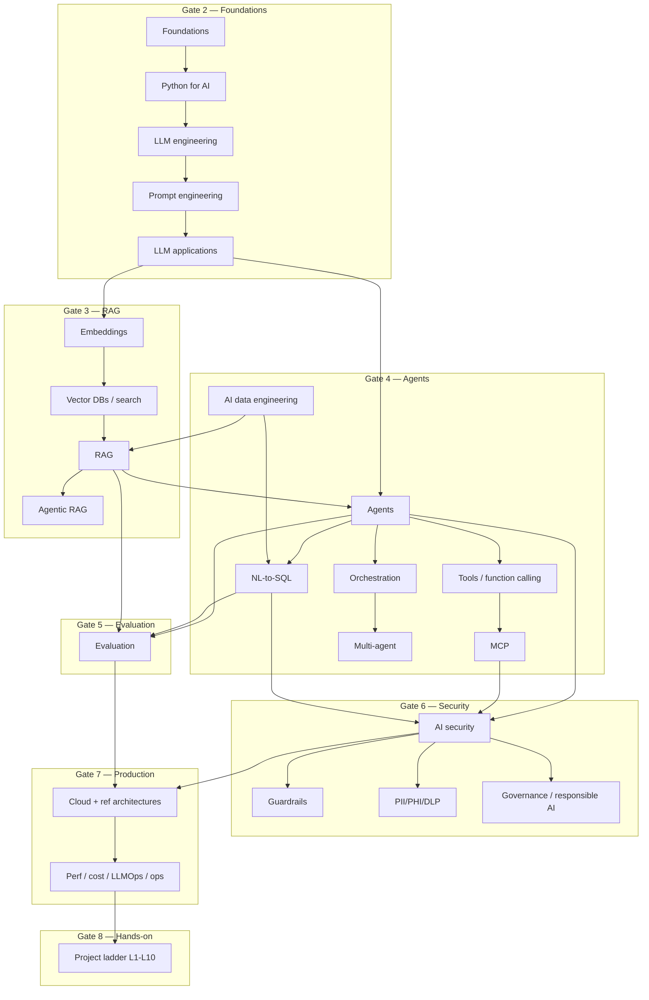

# Learning dependency graph

Gate 0 item 3. Read top-to-bottom. Do not skip security/evaluation until “after agents feel fun.”

Note: `AG → TOOL` is a *uses* dependency (agents invoke tools). Teaching order is Tools before Agents ([learning-sequence.md](learning-sequence.md) and the taxonomy spine). Do not read that arrow as “learn agents first.”

## Hard prerequisites

| Topic | Must already understand |
|---|---|
| RAG | Embeddings, chunking purpose, why ACLs on chunks matter conceptually |
| Agents | LLM apps, tools as APIs, why a workflow may be better |
| MCP | Tools/function calling, trust boundaries, identity |
| NL-to-SQL | Query planning, SQL injection, row/column security |
| Multi-agent | Single-agent failure modes, handoff vs supervisor trade-off |
| Production ref arch | Evaluation + security + observability at least at logical level |

## Parallel tracks (safe)

- Azure vs AWS vs GCP mappings can be learned after the vendor-neutral architecture (do not start with a single vendor catalog).
- Databricks track after data-engineering + RAG, not before.
- Interview/anti-pattern folders consume later gates; do not author them first.

## Recommended sequence (human)

See [learning-sequence.md](learning-sequence.md).
