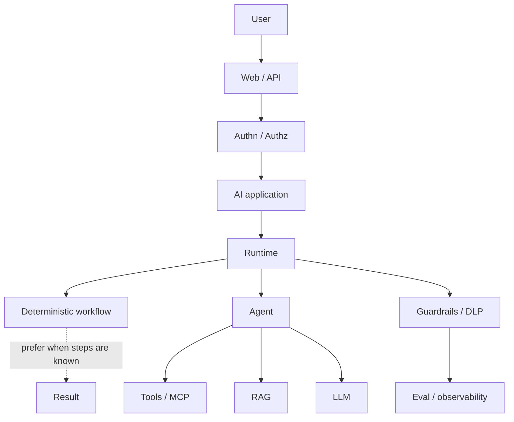

# Gate 1 — Architecture validation

Gate 1 validates maps. It does **not** write foundation curriculum. Durable claims below; volatile vendor rows stay in [`../99-META/technology-status.yaml`](../99-META/technology-status.yaml) with `source_id`.

## What was validated

| Artifact | Verdict |
|---|---|
| Canonical logical architecture | Confirmed: identity → app → runtime → model router / tools / RAG; cross-cutting guardrails, eval, observability |
| Cloud sketches | Confirmed as sketches, not BOMs. No SKU catalogs added |
| Learning sequence | Confirmed; see [learning-sequence.md](learning-sequence.md) Gate 1 confirmation |
| Knowledge graph | Edges reviewed; `agent may-be workflow` **dropped**; non-agent apps no longer `kind: agent-flavor` |
| Technology categories | Decision **stubs** only — [technology-decision-stubs.md](technology-decision-stubs.md) |

## Logical stack (confirmed)

Architect rule (durable; also stated on Microsoft Learn Agent Framework overview, `SRC-MS-AGENT-FRAMEWORK`): if you can write a function or workflow for a stable procedure, do that instead of an agent.

## Graph corrections (this gate)

| Change | Why |
|---|---|
| Removed `agent` → `may-be` → `workflow` | A workflow is not a kind of agent |
| Added `workflow` → `alternative-to` → `agent` | Prefer workflow when steps are known |
| Added `when-not-agent` node | Negative space is first-class |
| `simple-llm-app` / `structured-output` kind → `app-flavor` | They are LLM apps, not agents |
| Added permission / eval / MCP identity edges | Matches reference architecture and MCP motif (`SRC-MCP-ARCHITECTURE`) |

Machine file: [`../99-META/knowledge-graph.json`](../99-META/knowledge-graph.json) (`status: gate-1-validated`).

## Cloud mapping discipline

| Do | Do not |
|---|---|
| Map a **concern** (identity, retrieval, runtime) to a vendor family | Force every concern onto every cloud |
| Cite Learn/AWS/Databricks/GCP docs | Invent SKUs or “Company X built RAG” stories |
| Mark preview/Development | Treat hosted agents as GA (`SRC-MS-HOSTED-AGENTS` — preview as of 2026-09-07) |

## Sequence confirmation

The Gate 0 sequence is the teaching order: apps without agents → embeddings/RAG → tools → agents → MCP → multi-agent/NL2SQL → eval → security → production. Do not invert “agents are fun, security later.”

## Closing

### What should I remember?

Vendor-neutral architecture first. An agent is optional. Graph edges are claims we are willing to defend.

### What should I build?

Nothing executable this gate. Next: Gate 2 spine pages (few files, L1 first).

### What can go wrong?

Treating a cloud sketch as a bill of materials; treating a workflow as an agent.

### Senior question

Where does authorization actually filter — query, chunk, or tool?

### Principal question

Which edge in the graph would you delete because it over-claims?

### Architect challenge

Draw the same logical stack with **no** agent box. What still works?

### Learn next

[technology-decision-stubs.md](technology-decision-stubs.md), then Gate 2 foundations.
