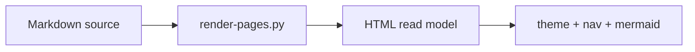

# Proposed interactive HTML architecture

Gate 0 item 11. Historical proposal below. **As built:** this lab is a hosted static course, not a file dump and not a depth dropdown.

## As built (hosted static course)

- Serve from **this repo root** on **8766** (`python -m http.server 8766` or `serve-lab.ps1`). Port **8000** is often another API.
- **Markdown is source.** `app/tools/render-pages.py` strips YAML frontmatter and writes sibling `.html`.
- **Linear path** with Previous / Next (`app/js/learn-path.js`). Sequence: Map → Foundations → RAG → Agents → Eval → Security → Production → Labs → Reference.
- **Top modules** open that module’s first lesson. **Sidebar** lists only that module’s lessons.
- **Concept pills** (Overview / Simple / When not / Do) are **other HTML files**. Clicking changes the URL. There is no L1–L8 `<select>` that hides headings.
- **Why-chains:** local JSON, only on that domain’s `01-overview.html`. Not a live LLM.
- Theme: **Dark | Light** buttons (`data-theme` on `<html>`).

## Goals

Navigation tree · concept pages · depth selector · expand/collapse · diagrams · decision trees · simulations · quizzes · architecture challenges · progress tracking where practical · related-concept links · source references · freshness indicators.

Progressive disclosure: do not show production architecture on first view.

## Proposed app layout (Gate 9)

```text
/
  index.html                 shell: nav + depth + content pane
  app/
    css/lab.css
    js/nav.js
    js/depth.js
    js/why-chain.js
    js/graph.js              reads 99-META/knowledge-graph.json
    js/progress.js           localStorage only
  00-MASTER-MAP/             maps
  NN-DOMAIN/**/*.md          rendered in-pane (static fetch)
  99-META/                   sources + freshness badges
```

No build step required for Gate 9 v1 (marked markdown or pre-rendered HTML). A bundler is optional later.

## Depth selector (superseded)

The Gate 0 sketch used `Simple — Medium — Hard — …` on **one page**. That model is **not** what shipped. Depth is split across files (`01-overview.html`, `02-simple.html`, `19-comparison.html`, `16-hands-on.html`). Changing “depth” must change the URL.

## “Why?” chains

Important statements are expandable reasoning chains (example: vector DB → semantic retrieval → keyword gaps → why not only an LLM → why hybrid). Stored as JSON beside the page, not generated live by an LLM.

## Simulations (small, honest)

- Agent tool-picker (order lookup)
- Failure: tool down → retry / fallback / human / fail
- RAG: chunk size, top-K, hybrid, rerank — **conceptual effects only**
- NL-to-SQL: reject unsafe SQL

Do not imply toy metrics are production performance.

## Architecture challenges

Free-text or structured rubric. Compare against considerations, not a single correct answer.

## What Gate 0 ships vs Wave 0 vs Gate 9

Gate 0: maps, graphs, source strategy, and a readable home page. Curriculum domains stay empty.

**Wave 0 (factory bake, not Gate 9):** shared dark/light CSS, theme toggle (`localStorage`), injected nav, and generated `.html` siblings from Gate 0 Markdown via `app/tools/render-pages.py`. Browser links `.html` only. Markdown remains the source of truth.

**Gate 9:** depth selector, Why? chains, graph explorer, simulations on top of this shell. Do not implement those now.


