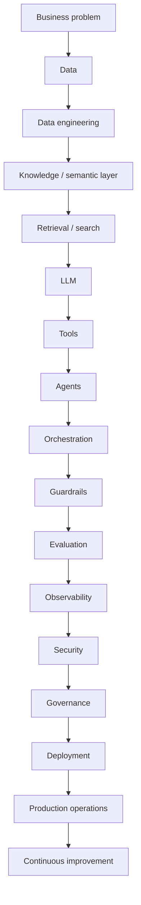

# Master mind map

Gate 0 visual of the spine. Interactive HTML visualization is Gate 9.

```text
Business problem
    → Data
        → Data engineering (batch / CDC / streaming)
            → Knowledge / semantic layer
                → Retrieval / search
                    → LLM
                        → Tools (APIs · MCP · data systems)
                            → Agents
                                → Orchestration
                                    → Guardrails
                                        → Evaluation
                                            → Observability
                                                → Security
                                                    → Governance
                                                        → Deployment
                                                            → Production operations
                                                                → Continuous improvement
```

## Same idea as a relationship map



## Discipline overlaps (do not collapse these)

| If you only know… | You will under-weight… |
|---|---|
| Data engineering | Agent state, tool authz, prompt injection |
| ML engineering | Retrieval ACLs, agent loops, token cost |
| LLM prompting | Evaluation harnesses, durability, DLP |
| Cloud landing zones | Grounding, golden datasets, agent failure modes |

## Architect bridge (durable)

Traditional: Kafka → Spark → Database → API

Agentic: Event → Agent → Decision → {Database | API | RAG | Human}

**Durable claim:** an agent does not automatically replace deterministic data pipelines. In many enterprise architectures it sits **above** deterministic systems and decides which capability to invoke.

## Canonical production stack (logical)

See [reference-architecture.md](reference-architecture.md). Depth selector later:

1. User → LLM → Tool → Result
2. Agent {Reason, Decide, Act}
3. Planner → tool select → execute → observe → next
4. Gateway → identity/policy → runtime (planner, state, memory, model router, RAG, tool registry) → guardrails → observability → evaluation
