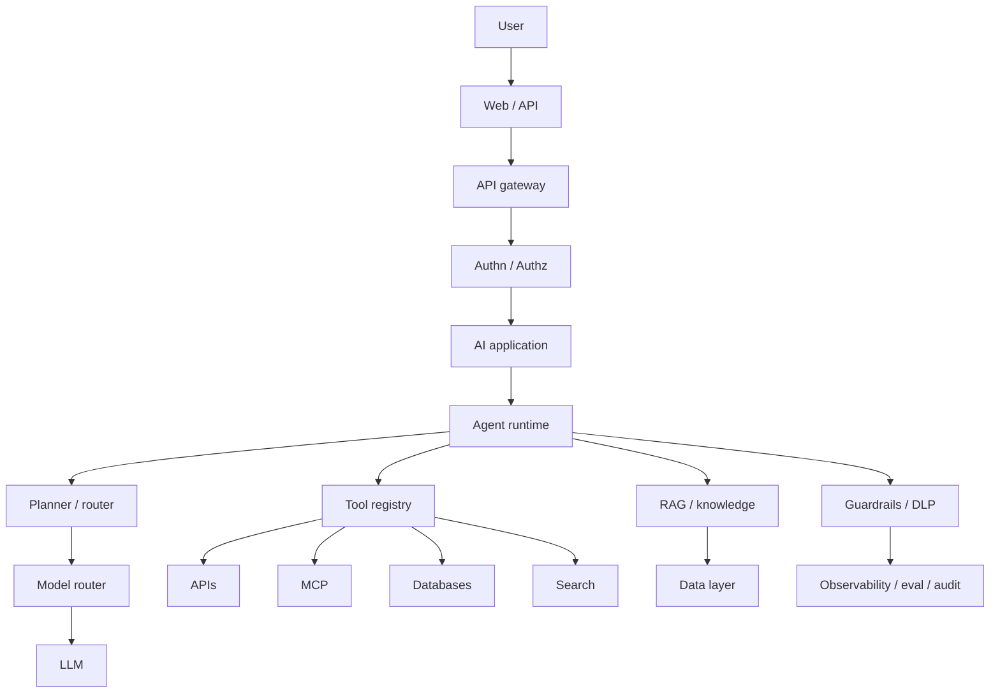

# Canonical production reference architecture

Gate 0 item 5. **Vendor-neutral logical architecture first.** Cloud mappings are sketches, not bills of materials. Do not invent SKUs or prices.

## Logical (durable)

```text
User
  → Web / Mobile / API
    → API Gateway
      → Authentication / Authorization
        → AI application
          → Agent runtime / orchestrator
            → Planner / router
              → Model router → LLM
            → Tool registry
                ├── APIs
                ├── MCP
                ├── Databases
                ├── Search
                └── Enterprise systems

RAG / knowledge layer (parallel capability, not always on)
  ├── Document processing
  ├── Chunking
  ├── Enrichment
  ├── Embeddings
  ├── Search
  └── Reranking

Data layer
  ├── PostgreSQL / SQL Server
  ├── Snowflake / Databricks / Delta Lake
  └── Object storage (ADLS / S3 / GCS)

Cross-cutting: identity, authorization, policy, guardrails, DLP,
PII/PHI detection, secrets, audit, evaluation, observability,
cost management, governance, CI/CD.
```



## Architect rule (durable)

If the steps are known and stable, prefer a **workflow** (or plain code) over an agent. Microsoft Agent Framework’s own overview states: if you can write a function to handle the task, do that instead of using an AI agent (`SRC-MS-AGENT-FRAMEWORK`).

## Data → AI knowledge pipeline (logical)

Source systems → batch/CDC/stream → ingest → raw → DQ → cleanse → enrich → metadata → document processing → ACL/security metadata → chunk → embed → search/vector index → hybrid retrieve → rerank → context assembly → RAG/agent → guardrails/DLP → output.

Toy (insufficient for enterprise): PDF → chunks → embeddings → vector search → LLM.

Production-oriented adds malware scan, parsing, classification, ACL extraction, permission filtering, citation, output DLP, audit, telemetry, evaluation.

## Physical / cloud mapping (volatile — re-verify)

Do not force every technology onto every cloud.

| Concern | Vendor-neutral | Azure sketch | AWS sketch | Databricks sketch |
|---|---|---|---|---|
| Identity | OIDC / policy engine | Microsoft Entra ID | IAM / Identity Center | Unity Catalog + cloud IdP |
| Model access | Model router / gateway | Microsoft Foundry model catalog / project endpoint (`SRC-MS-AGENT-FRAMEWORK`) | Amazon Bedrock | Model serving / AI gateway (confirm current product names in Databricks docs) |
| Agent runtime | Self-host graph runtime | Foundry Agent Service; **hosted agents documented as preview** (`SRC-MS-HOSTED-AGENTS`) | Bedrock Agents (`SRC-AWS-BEDROCK-AGENTS`) | Custom agents + managed MCP (`SRC-DATABRICKS-MCP`) |
| Retrieval | Hybrid search + ACL filter | Azure AI Search — **UNVERIFIED SKU list here; confirm on Learn at Gate 7** | Bedrock Knowledge Bases | AI Search, formerly Vector Search (`SRC-DATABRICKS-AI-SEARCH`) |
| Guardrails | Policy + deterministic filters | Azure AI Content Safety / Purview — confirm current names | Bedrock Guardrails (`SRC-AWS-BEDROCK-GUARDRAILS`) | UC grants + workspace policies |
| Observability | OpenTelemetry GenAI semconv (**Development**) (`SRC-OTEL-GENAI-SEMCONV`) | Azure Monitor + OTel | CloudWatch + OTel | MLflow tracing (confirm) |
| DLP | Presidio + enterprise DLP | Presidio + Purview | Macie / DLP — confirm | Tags + UC |

Naming note (Learn, 2026-09-07): Azure sketches use **Microsoft Foundry** / **Foundry Agent Service** / **Microsoft Foundry Agent Service**. Previous brand: **Azure AI Studio / Azure AI Foundry**. Docs URL path remains `/azure/foundry/`. This is not a rename invented here.

GCP: Google ADK + Vertex AI family (`SRC-GOOGLE-ADK`). Treat “Gemini Enterprise Agent Platform” marketing renames as **volatile** — confirm on Google Cloud docs before teaching.

## Five reference architectures (stubs until Gate 7)

| ID | Name | Distinctive risk |
|---|---|---|
| A | Enterprise RAG | ACL leakage via chunks; stale indexes |
| B | Enterprise AI agent | Excessive agency; tool blast radius |
| C | Agentic NL-to-SQL | Injection, cartesian joins, PII columns |
| D | Data engineering agent | Write tools against pipelines |
| E | Secure enterprise multi-agent platform | Confused deputy, A2A trust |

Each later needs: frontend, API, identity, gateway, runtime, LLM, RAG, data, security, evaluation, observability, CI/CD, infra, DR, cost model — vendor-neutral + Azure + AWS (+ Databricks where relevant).

## Failure-first checklist (every architecture)

LLM timeout/unavailable · embedding/search/DB down · tool timeout/wrong data · loops · wrong tool · prompt injection · bad retrieval · wrong SQL · PII/PHI leak · token/cost explosion · context overflow · model regression · index corruption · stale data.

For each: detect, mitigate, fallback, recover, alert, test.
