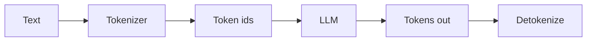

# Foundations

Level 1. Audience: people who already ship pipelines. This is not “what is AI.”

## What is it?

An LLM does not read your string the way a Kafka consumer reads bytes. It reads **tokens** — integer pieces of text produced by a tokenizer. Official OpenAI `tiktoken` docs describe BPE as reversible, lossless, and (in their words) about **4 bytes per token on average** (`SRC-TIKTOKEN`). That average is a rule of thumb, not a capacity SLA.

**Context window** is the model’s working set: prompt + completion must fit. Overflow is not “it gets a bit worse” — it fails or silently drops, depending on the API (behavior is **volatile**; check the vendor).

**Agency** is the permission to *choose the next action* (call a tool, loop, wait). A single LLM call with a schema is an **application**. A loop that picks tools is an **agent**. Microsoft’s Agent Framework overview says: if you can write a function to handle the task, do that instead of an AI agent (`SRC-MS-AGENT-FRAMEWORK`).

## Data / cloud analogy

| Familiar | LLM analog |
|---|---|
| `max.message.bytes` / payload limit | Context window |
| Serialization format (Avro vs JSON) | Tokenizer / encoding |
| Orchestrator that calls APIs in a fixed DAG | Workflow (prefer this) |
| Orchestrator that *decides* which job to run | Agent |

## Why it exists

Tokens make training and billing discrete. Context bounds memory. Agency exists for *unknown* next steps — not for a known Spark job.

## When NOT to use an agent

See [19-comparison.md](19-comparison.md). Default: **workflow, SQL, or one structured call**.

## What should I remember?

Tokens ≠ words. Context is a hard budget. Agency is optional and expensive.

## What should I learn next?

[02-simple.md](02-simple.md) — one call. Then [05-LLM-APPLICATION-ENGINEERING/01-overview.md](../05-LLM-APPLICATION-ENGINEERING/01-overview.md).
