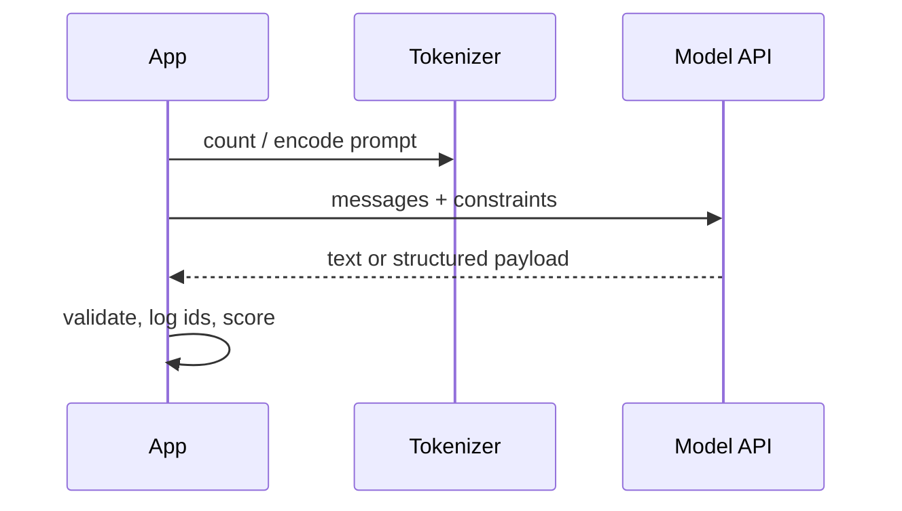

# One LLM call (simple)

A production-shaped mental model before tools or RAG.

## How it works

1. Build a **contract**: input fields, output shape, refusal cases.
2. Estimate tokens (`SRC-TIKTOKEN`, `SRC-TIKTOKEN-COOKBOOK`).
3. Call the model once.
4. **Validate** the output (schema, allow-list, SQL AST later — not this gate).
5. Record: model id, prompt version, token counts, latency. Do not log raw PII (`SRC-NIST-AI-600-1` privacy / information-security themes).

Toy: paste into a chat UI.  
Production-oriented: versioned prompt, typed output, eval set of 20 golden cases, identity of the caller.

## How it fails

| Failure | What you see | First control |
|---|---|---|
| Context overflow | Error or truncated prompt | Count tokens first |
| Confabulation | Fluent wrong fact | Ground or refuse (`SRC-NIST-AI-600-1`) |
| Schema drift | JSON that does not parse | Constrained decode + local validate |
| Cost spike | Surprise bill | Cap max tokens; cache static prefix |

Exact error codes and parameter names are **volatile** — read the vendor page at implement time.

## What should I build?

A function `classify(ticket) -> {label, confidence}` with a golden CSV. Not an agent.

## What can go wrong?

Treating chat-UI success as an eval harness.
