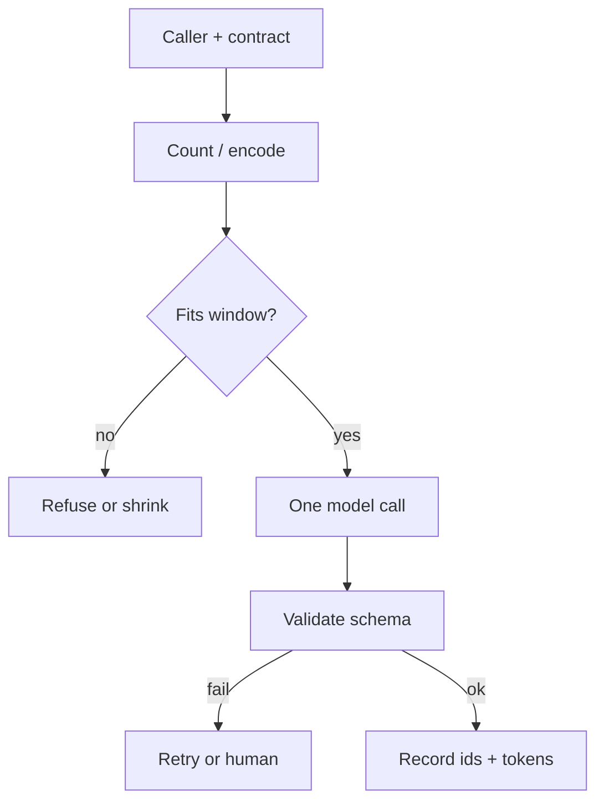

# Foundations (Medium)

Same topic as [Simple](02-simple.md): one model call, a token budget, and a contract. This page is the **mechanism** — not a new product.

## How a call actually spends the budget

1. **Tokenize** the prompt (and later the completion). Official `tiktoken` docs: BPE is reversible and lossless; they state about **4 bytes per token on average** (`SRC-TIKTOKEN`). That average is not a capacity SLA.
2. **Fit the working set.** Prompt + completion must stay inside the context window. Overflow is vendor-specific (error vs silent drop) — **volatile**.
3. **Constrain the output.** Prefer a schema the runtime can validate locally (`SRC-OPENAI-STRUCTURED-OUTPUTS` — wire-format field names **UNVERIFIED** after fetch timeout; the durable idea is schema + local check).
4. **Score the call.** Gold cases first. An LLM-as-judge is a helper, not ground truth (`SRC-OPENAI-EVALS`, `SRC-NIST-AI-600-1`).

## Agency is a later branch

Microsoft’s Agent Framework overview: if you can write a function, do that; use a **workflow** when steps are known; use an **agent** when the next tool is not (`SRC-MS-AGENT-FRAMEWORK`).

| You already know | Use |
|---|---|
| Input → label / JSON | One call + validate |
| Fixed three API hops | Workflow / DAG |
| Unknown next hop | Agent — [10](../10-AGENTS/01-overview.md) after [when not](19-comparison.md) |

## How it fails at this depth

| Failure | Durable control |
|---|---|
| Prompt grows; completion is cut | Count before send; cap max tokens |
| Fluent wrong fact | Ground or refuse (`SRC-NIST-AI-600-1` confabulation) |
| Schema-looking garbage | Constrained decode **and** local parse |
| Logs contain real PII | Synthetic ids only; privacy theme in `SRC-NIST-AI-600-1` |

## What should I remember?

Medium is still **one hop**. Complexity here is contracts, budgets, and eval — not a tool loop.

## What should I learn next?

[Complex — how vendors document this](15-real-world-example.md) · [When not an agent](19-comparison.md)
