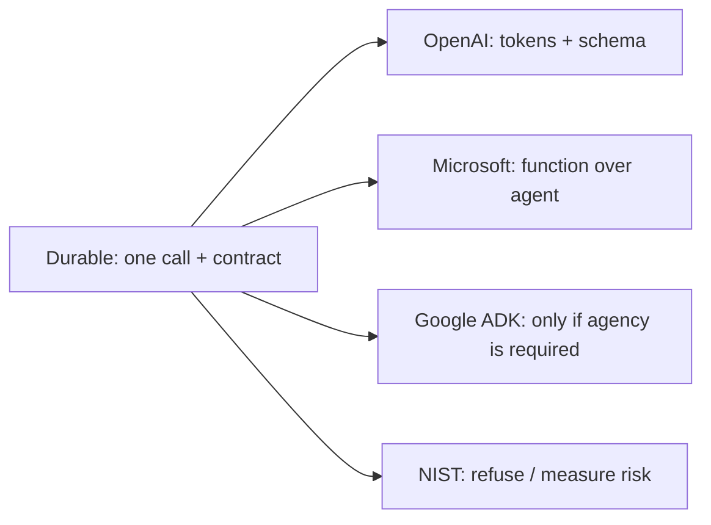

# Foundations (Complex) — how vendors document the same idea

Same topic as Simple / Medium. This is **not** an internal leak of how Google Search or ChatGPT are built. It is what **official docs** say you should ship.

We do **not** invent “Netflix / Uber / Meta internally does X.” If there is no fetchable Tier 1/2 URL, the claim is **UNVERIFIED** and omitted.

## Mapping: durable idea → official page

| Durable idea | What a vendor publishes | Source |
|---|---|---|
| Tokens are integers; count before you send | OpenAI `tiktoken`: BPE, `get_encoding` / `encoding_for_model`, ~4 bytes/token average | `SRC-TIKTOKEN`, `SRC-TIKTOKEN-COOKBOOK` |
| Typed output + local validate | OpenAI structured-outputs guide (official path). Request field names **UNVERIFIED** (fetch timed out) | `SRC-OPENAI-STRUCTURED-OUTPUTS` |
| Prefer a function / workflow over an agent | Microsoft Agent Framework: function when you can write one; workflow when steps are known | `SRC-MS-AGENT-FRAMEWORK` |
| Hosted agent runtime is a product, not the default | Microsoft Foundry Agent Service / hosted agents (**preview** — do not treat as GA) | `SRC-MS-FOUNDRY-AGENTS`, `SRC-MS-HOSTED-AGENTS` |
| If you do need an agent toolkit | Google Agent Development Kit (ADK) docs | `SRC-GOOGLE-ADK` |
| Eval is a registry + harness, not vibes | OpenAI `evals` GitHub | `SRC-OPENAI-EVALS` |
| Confabulation and privacy are named risks | NIST AI 600-1 generative profile | `SRC-NIST-AI-600-1` |

## What a production architect actually copies

**Toy:** paste a prompt in a chat UI.

**Production-oriented (still not an agent):**

1. Version the prompt and the model id.
2. Count tokens (`SRC-TIKTOKEN`).
3. Validate output locally.
4. Keep a gold CSV (`SRC-OPENAI-EVALS` is a framework, not your gold).
5. Do not log real PII (`SRC-NIST-AI-600-1`).

SKU names, prices, and context-window integers are **volatile**. Read the vendor page at implement time. This lab does not bake dollar rates.

## What a principal would challenge

- “We used Azure / Bedrock / Vertex, so we are production.” A SKU is not a contract.
- “The model will remember our handbook.” That is RAG or a database — next module.
- “We need an agent for classification.” Microsoft’s own overview says write the function (`SRC-MS-AGENT-FRAMEWORK`).

## What should I learn next?

[When not an agent](19-comparison.md) · [LLM apps, not agents](../05-LLM-APPLICATION-ENGINEERING/01-overview.md) · [Sources catalog](../00-MASTER-MAP/sources-and-reading.md)
