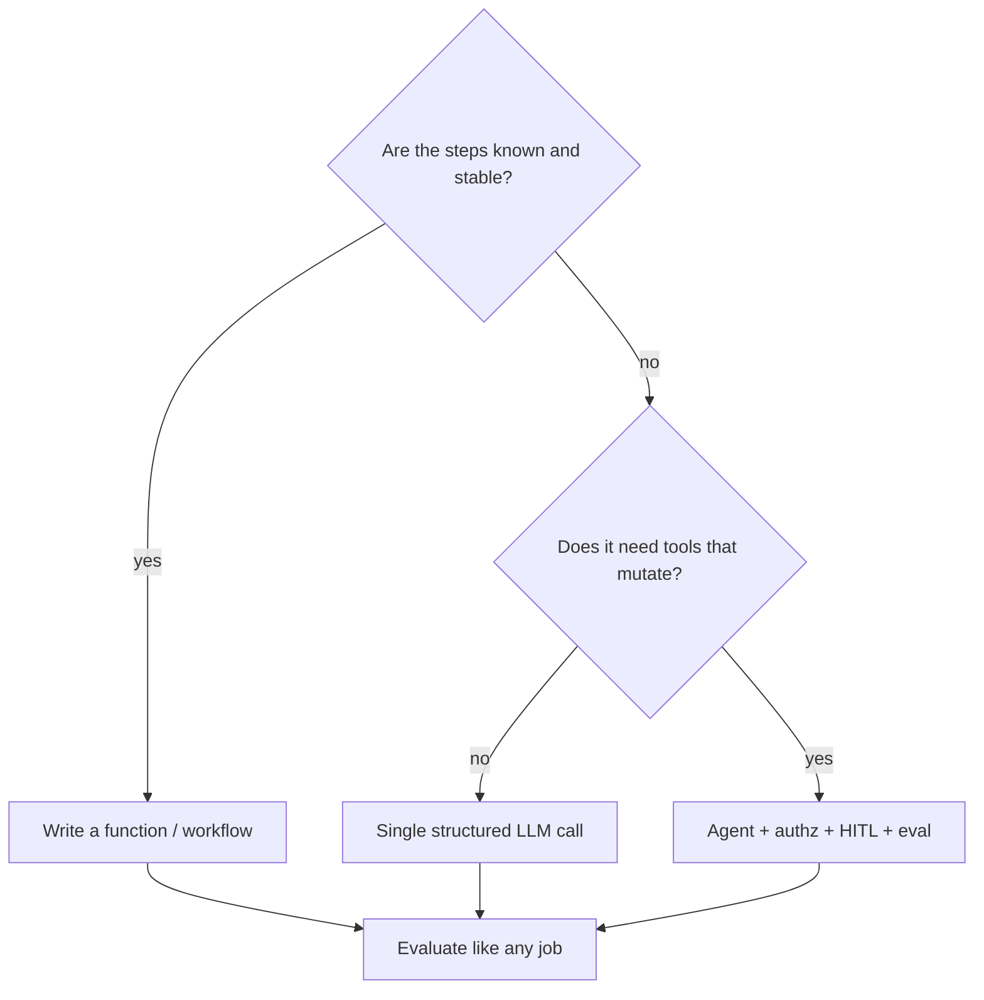

# When not to use an agent

This page is first-class, not a footnote. OWASP LLM Top 10 2026 includes **excessive agency** (`SRC-OWASP-LLM-TOP10-2026`). Microsoft Learn’s Agent Framework overview tells you to prefer a function when a function is enough (`SRC-MS-AGENT-FRAMEWORK`).

## Decision table

| Situation | Prefer | Not an agent because |
|---|---|---|
| Known steps, stable order | Workflow / code / Airflow / Step Functions | The graph is the spec |
| Lookup by key | API or SQL | No decision under uncertainty |
| Transform rows | Spark / dbt / stored proc | Deterministic quality beats fluency |
| One classification or extraction | Structured LLM call | One hop; validate the object |
| Human already has a form | UI + API | Agency adds a confused deputy |
| Tool can write to prod | Approval workflow or no LLM | Blast radius (`SRC-OWASP-LLM-TOP10-2026`) |

## Alternatives

Deterministic workflow · REST · SQL · semantic layer · rules engine · human task.

## What a production architect worries about

Loops, tool identity, cost, and “it worked in the demo.” An agent is a **control-plane** decision, not a default runtime.

## What a principal would challenge

“We need an agent” without naming the unknown decision and the tool blast radius.

## What should I learn next?

[16-hands-on.md](16-hands-on.md), then LLM apps without agents.
