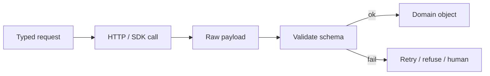

# Python for AI

You already write Python. This domain is the **shape** of AI-adjacent code: typed payloads, timeouts, retries, and never trusting model text as code.

## What is it?

The same skills you use for a REST client talking to a flaky downstream: **async or explicit timeouts**, **schema at the boundary**, **idempotency keys**, **structured logs**. The model is just another unreliable I/O.

## Data / cloud analogy

A Databricks job that calls a vendor HTTP API: you do not `eval` the response. You deserialize, validate, and dead-letter. LLM output is that response.

## What we will not reteach

Loops, list comprehensions, “what is a class,” basic SQL.

## When not to use an agent

If your Python already knows the next function to call, **call it**. Do not wrap a known `update_row()` in a tool-picking loop (`SRC-MS-AGENT-FRAMEWORK`).

## What should I remember?

Treat the model as an untrusted parser/generator behind a contract.

## What should I learn next?

[02-simple.md](02-simple.md)
