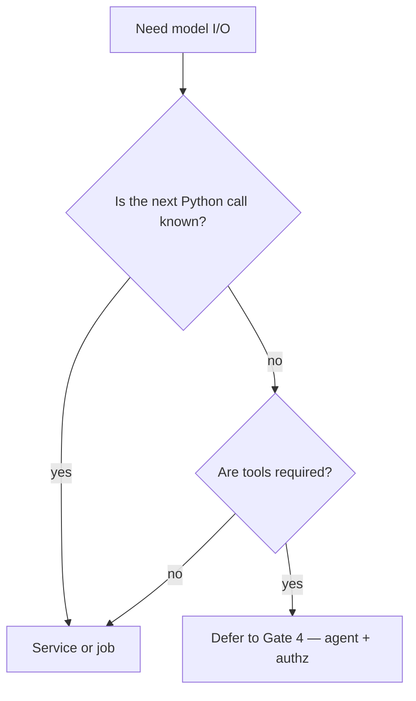

# Comparison

| Shape | Use when | Do not use when |
|---|---|---|
| Notebook | Exploration, token experiments (`SRC-TIKTOKEN`) | Serving customers |
| CLI / batch job | Backfill, eval harness | Interactive tool-picking |
| Sync/async service | One structured call, SLA, authn | You have not validated output |
| Agent runtime | Unknown next tool, after Gate 4 | The next call is already `classify()` |

## Principal question

Why is there a `tools=` array on a function that only ever calls one endpoint?
