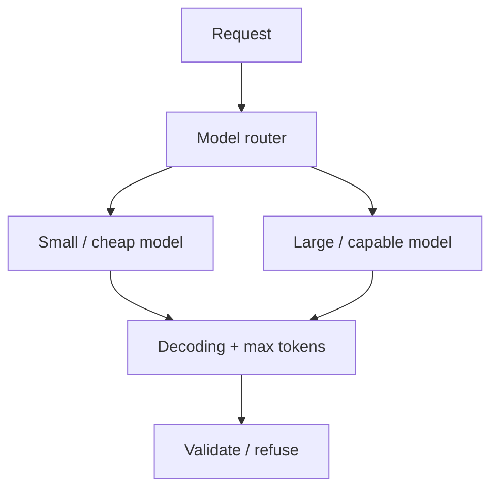

# LLM engineering

Level 1. The model is a **component** with knobs: context, decoding, routing, output shape. It is not a coworker.

## What is it?

**LLM engineering** is choosing and operating that component: which model family, how much context you spend, how greedy or random decoding is, whether output is free text or a schema, and how you route easy vs hard traffic.

## Data / cloud analogy

A query engine: you pick warehouse size, max scan, and result format. You do not let the engine invent extra tables. Routing cheap/small vs large models is like a query governor.

## Durable vs volatile

| Durable | Volatile |
|---|---|
| Tokens, context budget, validate output | Model names, context sizes, SKUs |
| Temperature-style randomness exists | Exact parameter names and defaults |
| Routing by difficulty / risk | Vendor “router” product names |

Context-window sizes and current model IDs are **UNVERIFIED** here on purpose — they churn. Re-read official model cards at implement time.

## When not to use an agent

Routing between two **single calls** is still an application. A router agent that also wields write-tools is Gate 4.

## What should I remember?

Spend context like money. Decode like a risk control. Route like a load balancer.

## What should I learn next?

[02-simple.md](02-simple.md)
