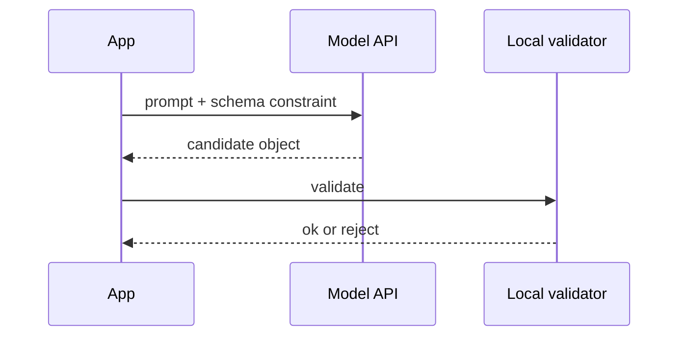

# Decoding and structured output (simple)

## How it works

**Decoding** turns next-token probabilities into a string. Higher randomness (often called temperature) increases variety and usually increases schema breakage. For classification, you typically want **low** randomness.

**Structured output** means the application expects an object (JSON matching a schema), not an essay. Official OpenAI guide URL: `SRC-OPENAI-STRUCTURED-OUTPUTS`. **Fetch of that page timed out 2026-09-07** — do not memorize request field names from a chat model. Durable practice:

1. Publish a JSON Schema (or equivalent) as the contract.
2. Ask the vendor’s *current* constrained-decoding feature to honor it.
3. **Still validate locally** — the network can lie, models can still fail.

NIST AI 600-1 treats **confabulation** as a generative-AI risk (`SRC-NIST-AI-600-1`). A schema reduces shape errors; it does not make facts true.

## When to use / not

| Use structured single call | Do not |
|---|---|
| Labels, extractions, tool-args later | Open-ended research prose |
| You have a golden set | You will “just read the vibe” |

## Cost / scale

Output tokens dominate many bills. Cap max completion tokens. Exact prices: **not recorded** (Gate 7).
