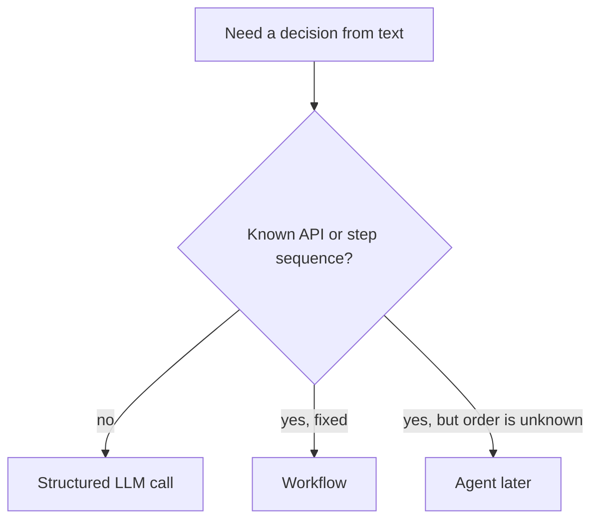

# Comparison

| Mode | Output | Control | Default? |
|---|---|---|---|
| Free text | Prose | Weak | Demos only |
| Structured call | Object | Schema + tests | **Yes** for apps |
| Tool-calling agent | Side effects | Authz, HITL, eval | Only if steps unknown |

If the “tools” list has one function you always call, you wanted a workflow (`SRC-MS-AGENT-FRAMEWORK`).
