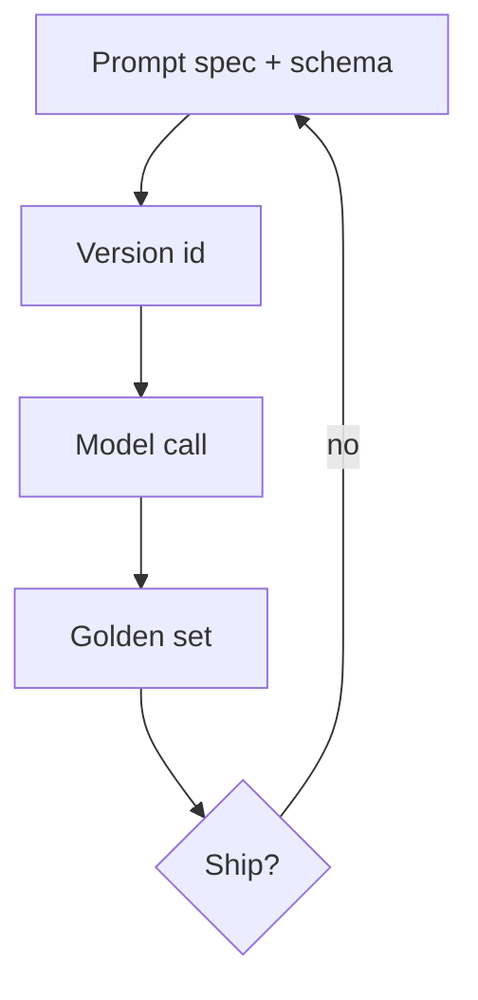

# Prompt engineering

Not folklore. A **prompt is a specification** that must be versioned, tested, and owned like an API schema.

## What is it?

You write the contract: role, inputs, output shape, refusals, and examples. You measure whether the contract holds. “Magic phrases” without eval are not engineering.

## Data / cloud analogy

An OpenAPI spec plus contract tests. Changing the prompt is a **breaking change** if callers depend on field names.

## Why it exists

The model is trained to continue text. Without a spec you get a chat. With a spec you get an interface. Confabulation remains a risk even with a good spec (`SRC-NIST-AI-600-1`).

## When not to use an agent

If the prompt is “decide which of these five APIs to call,” you may want tools later. If the prompt is “extract these fields,” you want **one call** and tests.

## What should I remember?

Prompts are artifacts. No eval, no change.

## What should I learn next?

[02-simple.md](02-simple.md)
