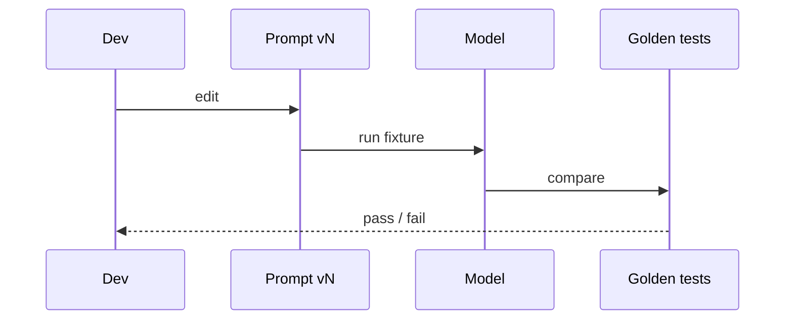

# A minimum prompt spec (simple)

Write these sections even if the file is 40 lines:

1. **Purpose** — one sentence.
2. **Inputs** — names, types, untrusted? (user text is untrusted: `SRC-OWASP-LLM-TOP10-2026` prompt injection).
3. **Output** — schema or enum.
4. **Refuse when** — missing data, out of policy.
5. **Non-goals** — no browsing, no tools, no “be helpful” override.
6. **Examples** — 3 input/output pairs that you will put in the golden set.

## How it fails

| Failure | Why |
|---|---|
| Prompt injection | User text treated as instructions |
| Silent policy change | Unversioned string in a notebook |
| Eval on anecdotes | Three Slack examples |

## Secure / evaluate

Do not put secrets in the prompt. Evaluate on fixtures, not vibes. LLM-as-judge waits for Gate 5.
