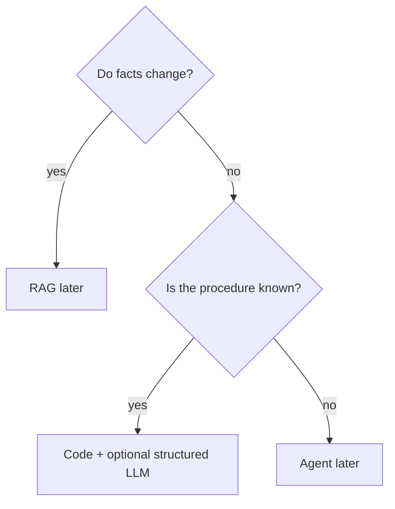

# Comparison (stubs, no bake-off)

| Need | First try | Not first |
|---|---|---|
| Change tone / fields | Prompt + schema | Fine-tune |
| Facts that change weekly | Retrieval (Gate 3) | Stuffing the prompt forever |
| Known procedure | Code / workflow | Agent (`SRC-MS-AGENT-FRAMEWORK`) |
| Unknown tool sequence | Agent (Gate 4) | A longer prompt |

Do not invent a vendor “prompt OS” SKU. Fine-tune vs RAG criteria stay in [technology-decision-stubs.md](../00-MASTER-MAP/technology-decision-stubs.md) (`D-RAG-FT`).
