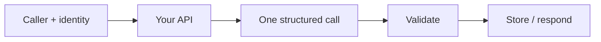

# LLM applications (not agents)

Gate 2 ends here on purpose. If you can ship a **single-call app** with eval, you are ready for embeddings later — not for a tool loop.

## What is it?

An LLM application: user or job → your API → **one** model invocation (maybe a cheap router) → validated object → downstream system. No autonomous tool picker.

Microsoft Learn: if you can write a function, do that instead of an AI agent (`SRC-MS-AGENT-FRAMEWORK`).

## Data / cloud analogy

A request/response microservice that calls a translator API. You would not give that service `DROP TABLE` as a tool.

## Flavors in this lab

| Flavor | Graph node | This gate |
|---|---|---|
| Simple LLM app | `simple-llm-app` | Yes |
| Structured-output app | `structured-output` | Yes |
| Tool / ReAct agent | `react-agent` | **No** — Gate 4 |

## What should I remember?

Most “AI features” should die as functions.

## What should I learn next?

[02-simple.md](02-simple.md), then Gate 3 embeddings — not agents.
