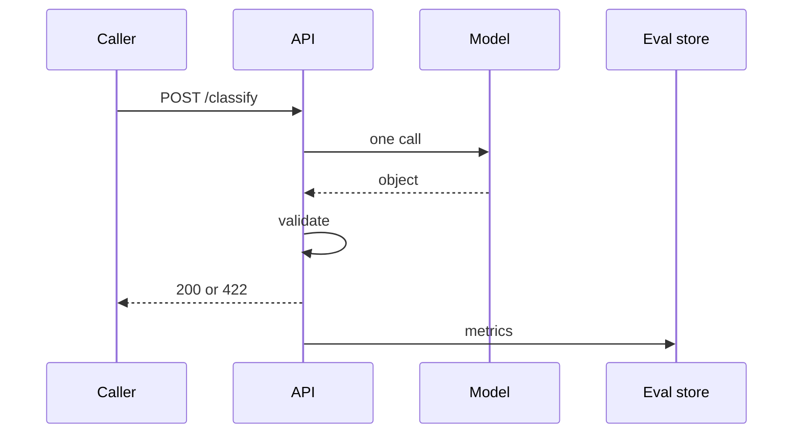

# Structured classification service (simple)

## How it works

1. Authenticate the caller (same as any API).
2. Bound the input size (token budget — `SRC-TIKTOKEN`).
3. Call the model once with a schema.
4. Validate; on failure return 422, not a second “creative” hop.
5. Write an audit row: `request_id`, `prompt_version`, `model_id`, token counts. Omit raw customer text unless policy allows (`SRC-NIST-AI-600-1`).

## Toy vs production-oriented

| Toy | Production-oriented |
|---|---|
| Notebook + printed JSON | Versioned prompt, golden set, timeouts |
| Shared API key in chat | Per-workload identity |
| No eval | Nightly fixture run |

## When NOT to use an agent

The path is known. Adding tools “for flexibility” is how you get excessive agency (`SRC-OWASP-LLM-TOP10-2026`).
