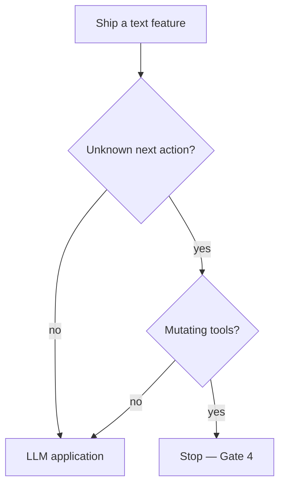

# App vs workflow vs agent

| | LLM app | Workflow | Agent |
|---|---|---|---|
| Next step | Fixed | Fixed (may include an LLM step) | Chosen at runtime |
| Tools | Optional one API you always call | Explicit nodes | Catalog + policy |
| Eval | Golden I/O | Job tests | Trajectory + side effects |
| Default | **This gate** | When many systems already exist | Gate 4, after failure modes |

Architect challenge: delete the agent box and list what still ships. That list is your MVP.
