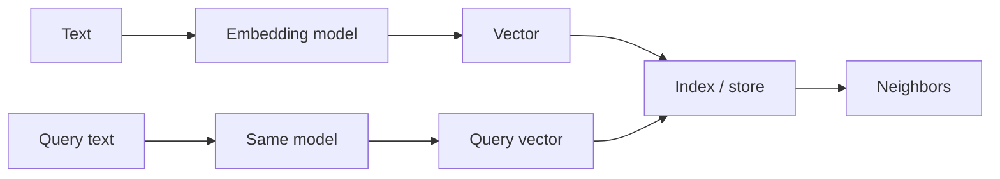

# Embeddings

Level 1. An embedding is a **numeric representation** of text (or other media) so that *nearby vectors mean nearby meaning* — for a given model and space.

## What is it?

A function `text → vector`. Same model + same version ⇒ comparable distances. Different models ⇒ **do not mix** in one index without a migration.

Official embedding API field names and current model IDs: **UNVERIFIED** this gate (`SRC-OPENAI-EMBEDDINGS` fetch timed out). The durable idea does not depend on them.

## Data / cloud analogy

A similarity join after a feature hash: you are not looking up a primary key; you are ranking neighbors. Like a fuzzy match, it will retrieve the *wrong* neighbor if the query and the chunk live in different “languages” (SQL ids vs prose, old vs new model).

## Why it exists

Lexical search misses paraphrase. Embeddings help recall. They do **not** replace ACLs or exact identifiers.

OWASP LLM Top 10 2026 includes **vector/embedding weaknesses** (`SRC-OWASP-LLM-TOP10-2026`) — poisoned or over-privileged vectors leak or mislead.

## When not to use embeddings

Exact SKU, order id, email — use the database. See [19-comparison.md](19-comparison.md).

## What should I remember?

Same model, same space. Similarity is not authorization.

## What should I learn next?

[02-simple.md](02-simple.md), then vector stores.
