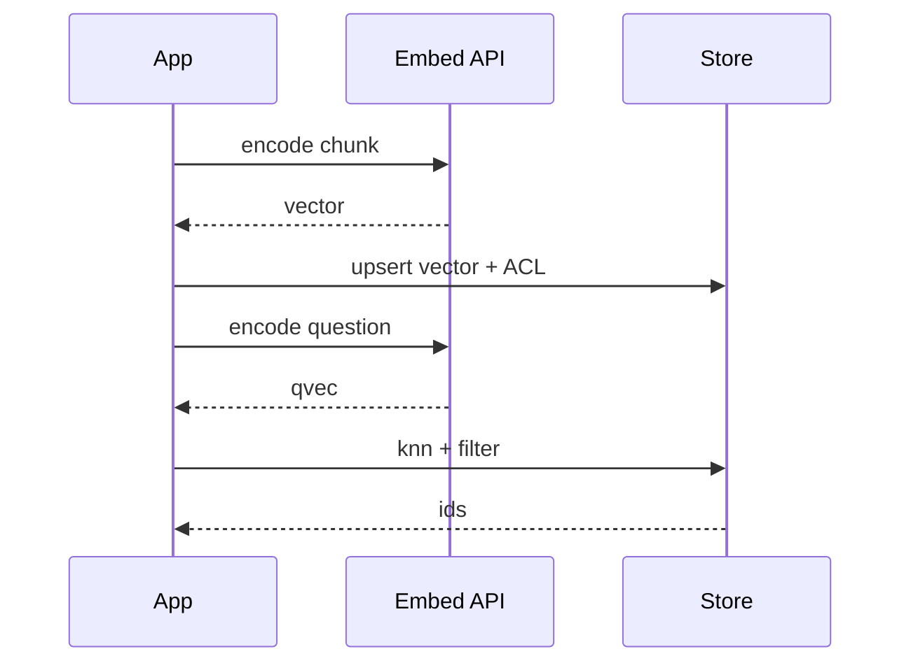

# One encode, one compare (simple)

## How it works

1. Normalize text (your rules: lowercase? strip PII? — decide, version it).
2. Embed with a **pinned** model id (volatile — read the vendor page).
3. Store vector **plus** document id, tenant, ACL, source URI, embed_version.
4. At query time embed the question with the **same** model.
5. Rank by a distance you actually understand (cosine / inner product — confirm what the store uses).

## How it fails

| Failure | Control |
|---|---|
| Model swap, old vectors | Re-embed or dual-write version |
| Empty / huge chunk | Chunk policy + token budget |
| PII in the vector store | DLP before embed (`SRC-NIST-AI-600-1`) |
| Cross-tenant neighbor | Filter **before** or **inside** knn, not after the LLM sees it |

## Evaluate

Not “the answer sounded good.” Measure retrieval: did the gold chunk appear in top-K?
