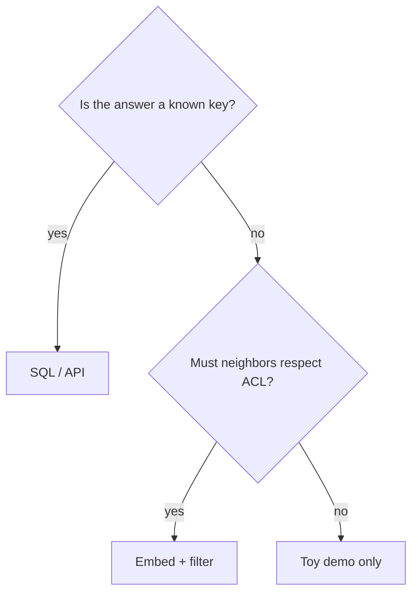

# When not to embed

| Need | Prefer | Not embeddings |
|---|---|---|
| Primary key / order id | SQL / API | Fuzzy neighbors invent the wrong row |
| Regulated exact match | Deterministic lookup | Similarity is not evidence |
| Fast-changing facts | Fresh store + retrieve, or don’t cache | Stale vectors |
| Tiny closed vocab | Enum / classifier | Overkill |

Do not treat embedding similarity as a permission check (`SRC-OWASP-LLM-TOP10-2026` vector/embedding weaknesses).
