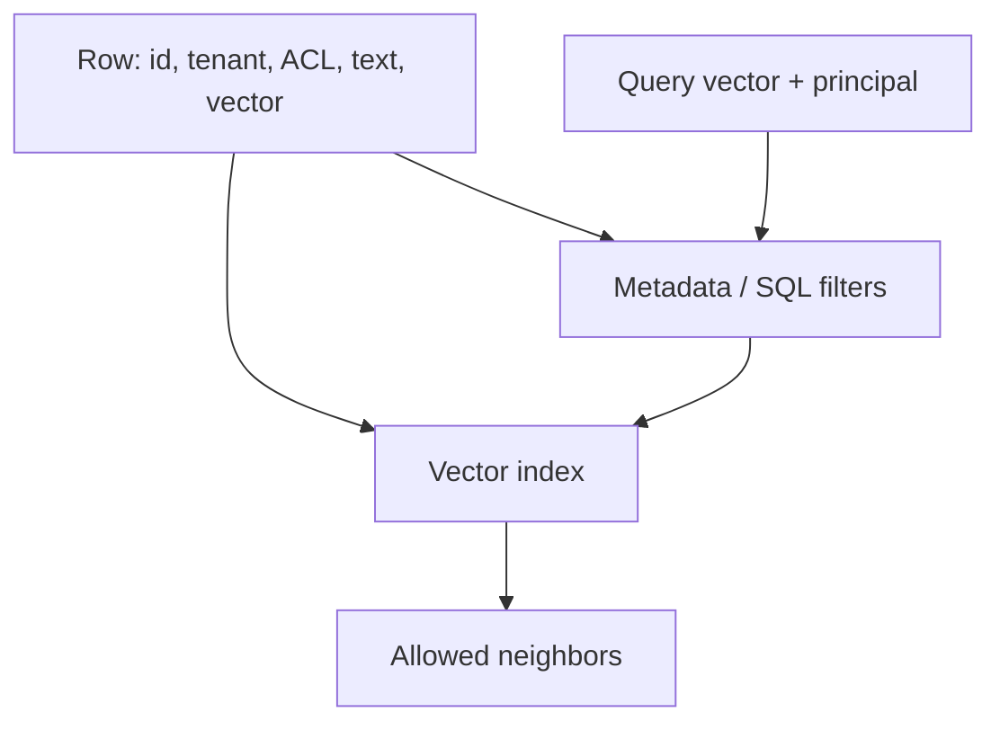

# Vector databases

Level 1. A vector store is an **index plus metadata**, not a second brain.

## What is it?

You store embeddings and retrieve nearest neighbors, usually with an approximate index for speed. Official **pgvector** is open-source vector similarity search for Postgres (`SRC-PGVECTOR`, repo page fetched 2026-09-07). Databricks documents **AI Search** (formerly Vector Search) as governed semantic/hybrid retrieval over lakehouse data (`SRC-DATABRICKS-AI-SEARCH`).

Index type names, replica SKUs, and Azure AI Search SKU lists are **UNVERIFIED** / deferred (Gate 7).

## Data / cloud analogy

A secondary index on a fact table: great for one access path, dangerous if you skip the row-level security that the warehouse already had.

## Why it exists

You cannot scan a million embeddings in Python every request. The store’s job is **speed + filters**. If it cannot filter by tenant/ACL, it is a toy.

## When not to use a dedicated vector DB

Data already in Postgres and QPS is low — pgvector may be enough (`SRC-PGVECTOR`). Data already in a governed lakehouse search — do not add a shadow index without a reason (`SRC-DATABRICKS-AI-SEARCH`).

## What should I remember?

Neighbors without filters are a data leak.

## What should I learn next?

[02-simple.md](02-simple.md)
