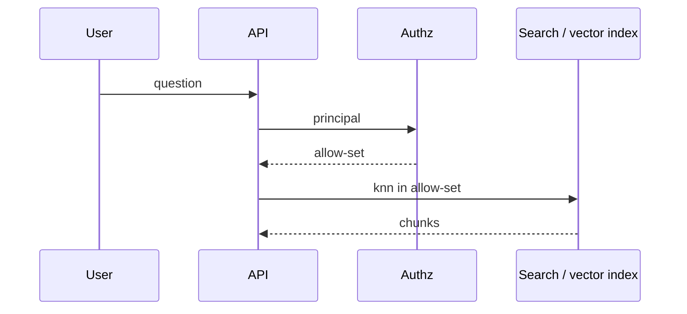

# Filter then rank (simple)

## How it works

Production-shaped retrieve:

1. Resolve the caller’s **principal** (groups, tenant, row grants).
2. Restrict the candidate set (SQL `WHERE`, search filter, UC grants).
3. Rank remaining vectors (or hybrid lexical + vector).
4. Return **ids + scores + citations**, not raw secrets.

Databricks AI Search is documented as governed semantic/hybrid search (`SRC-DATABRICKS-AI-SEARCH`). Treat that as a **vendor sketch**, not a requirement to use Databricks.

## How it fails

| Failure | Why it matters |
|---|---|
| Filter after top-K | Top-K may be *all* other tenants; you return empty or you cheat |
| No embed_version | Mixed spaces |
| Stale index | Correct ACL, wrong facts |
| Logging hits | PII in chunks (`SRC-NIST-AI-600-1`) |

Exact filter syntax is volatile — read the store’s docs at implement time.
