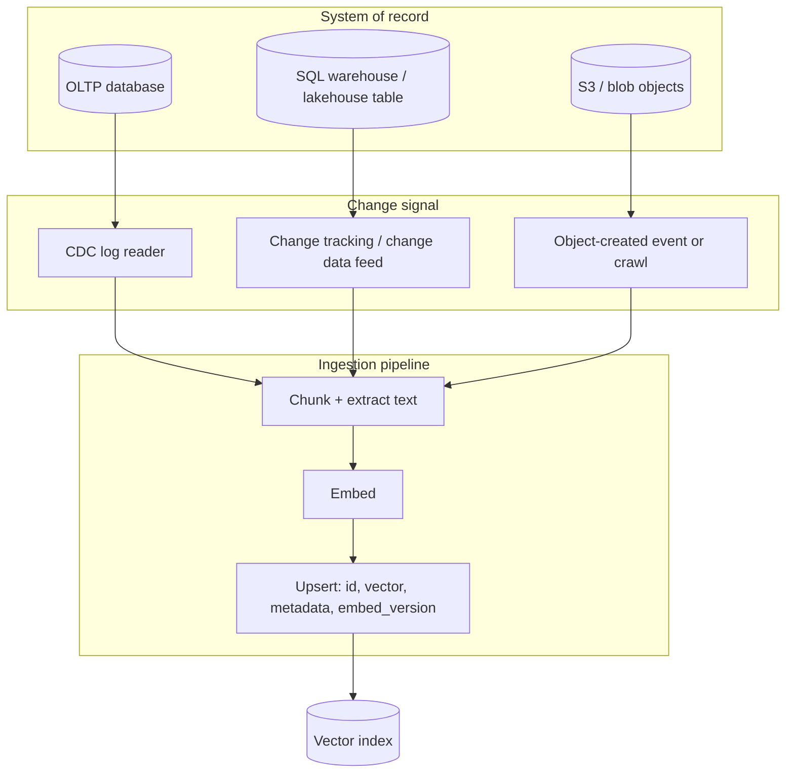

# Vector search (Medium) — getting warehouse, database, and object-store data into an index

Same topic as [Filter then rank](02-simple.md). This page is about the **other half** of vector search: how rows in a SQL warehouse, tables in an OLTP database, or files in S3/blob storage actually become vectors in an index — and how that stays current.

## The shape is always: source → change signal → embed → upsert

Whatever the vendor calls it — indexer, Delta Sync Index, dynamic table refresh, knowledge base sync job — the pipeline is the same four steps. The variable that actually changes per vendor is **how the change signal is produced** and **how much lag you tolerate**.

## How each source type actually feeds a vector index

| Source | Change signal | Typical freshness | Vendor examples |
|---|---|---|---|
| OLTP database (Postgres, MySQL, SQL Server) | Log-based CDC reading the transaction log (`SRC-DEBEZIUM-FAQ`) | Seconds, event-driven | Debezium → Kafka → embed worker → upsert; or skip the hop entirely and store vectors in the same database with pgvector (`SRC-PGVECTOR-README`) |
| SQL warehouse / lakehouse table | Change tracking on the source table, consumed by a scheduled or continuous refresh | Minutes (target-lag) to near-real-time | Databricks Delta Sync Index requires Change Data Feed on the source Delta/streaming/Iceberg table, then runs **continuous sync** (standard endpoints) or **triggered sync** via REST call (`SRC-DATABRICKS-VECTOR-SEARCH`); Snowflake Cortex Search refreshes incrementally against a `TARGET_LAG` SLA when the base table has a primary key (`SRC-SNOWFLAKE-CORTEX-SEARCH`) |
| Object storage (S3, Blob, ADLS, OneLake) | Indexer crawl (scheduled) or an object-created event | Minutes to hours for crawl; near-real-time if event-driven | Azure AI Search indexers pull from Blob Storage, Cosmos DB for NoSQL, ADLS Gen2, Table Storage, and OneLake, with **integrated vectorization** doing chunk+embed inside the indexer pipeline (`SRC-AZURE-VECTOR-SEARCH-OVERVIEW`); Bedrock Knowledge Bases sync an S3 data source into whichever vector store is attached — OpenSearch, S3 Vectors, Aurora/pgvector, Pinecone, MongoDB Atlas, Redis, or Neptune Analytics (`SRC-AWS-BEDROCK-KB-SETUP`) |
| Managed analytics store already the source of truth | Batch import or streamed upsert | Batch by default, streaming available for near-real-time | Vertex AI Vector Search imports embeddings computed from BigQuery, or accepts streamed upserts directly (`SRC-GCP-VERTEX-VECTOR-SEARCH`) |

## Why "real-time" almost always means near-real-time

None of these systems re-embed the world on every write. They separate the **write path** (rows change) from the **index path** (vectors get replaced), and the gap between them is a design knob, not a bug:

- **Event-driven CDC** (Debezium-style) gets seconds of lag, but you own the embed worker, the queue, and idempotent upserts keyed by row id + `embed_version`.
- **Vendor-managed continuous/triggered sync** (Databricks, Snowflake) trades control for a documented SLA — set `TARGET_LAG` or enable Change Data Feed and the platform does the diffing.
- **Crawl/indexer** (Azure indexers, S3 data sources in Bedrock KB) is batch by nature; schedule it as tight as the source's write rate justifies, not tighter.

An index that claims "real-time" with no visible change-signal mechanism is a **toy** — assume poll-and-rebuild until the docs say otherwise.

## How it fails

| Failure | Why it matters |
|---|---|
| No `embed_version` on upsert | A model swap silently mixes two vector spaces in one index; neighbors stop meaning anything — this is exactly why Databricks' managed and self-managed embedding modes are **not interconvertible** (`SRC-DATABRICKS-VECTOR-SEARCH`) |
| CDC consumer lag unmonitored | Index looks healthy, answers are stale; correct ACL, wrong facts |
| Crawl schedule shorter than the data actually changes | Wasted embedding spend re-processing unchanged rows |
| No idempotency key on upsert | Reprocessing a Kafka partition after a crash duplicates vectors |
| Metadata not marked filterable at index-create time | Filters added later can require a full reindex (`SRC-AWS-BEDROCK-KB-SETUP`: filterable vs non-filterable metadata is set when the index is created) |

## Architect bridge

This is the same problem as keeping a materialized view or a search-engine replica in sync with a system of record — CDC, change-tracking columns, and event-driven crawls are the same three tools a data engineer already reaches for. A vector index is a specialized read replica; treat freshness as an SLO, not an afterthought.

## What should I remember?

"Real-time" vector search means near-real-time change propagation, not instant re-embedding — the freshness knob is the sync mechanism, not the query.

## What should I learn next?

[Complex — Azure / AWS / Google / Databricks / Snowflake / open-source products](15-real-world-example.md) · [When not](19-comparison.md)
