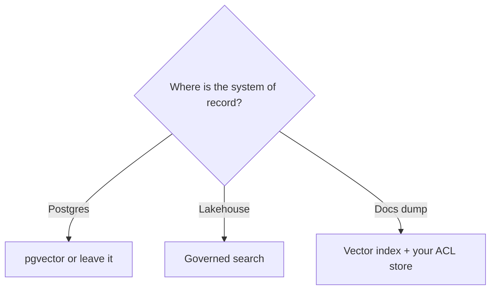

# Comparison (no winner SKU)

| Store shape | Use when | Not when |
|---|---|---|
| Postgres + pgvector | Relational source of truth, modest scale (`SRC-PGVECTOR`) | You need undocumented operators — re-read README |
| Search engine (hybrid) | Lexical + vector + facets | You ignore ACL fields |
| Dedicated vector DB | High QPS ANN, isolation from OLTP | You duplicate ACL and drift |
| Lakehouse AI Search | Data gravity in UC/lakehouse (`SRC-DATABRICKS-AI-SEARCH`) | Non-lakehouse app forced onto it |

Azure AI Search **SKU list: UNVERIFIED** (Gate 1 carry-forward).
