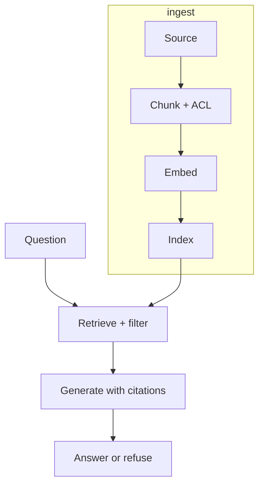

# RAG

Level 1. **Retrieval-Augmented Generation**: look up evidence, then ask the model to answer **from that evidence**.

## What is it?

Not “chat with your PDFs.” A pipeline: ingest → chunk → embed → index → retrieve → (optional rerank) → assemble context → generate → cite / refuse.

## Data / cloud analogy

A serving layer over a curated mart: the LLM is the renderer; the index is the mart. If the mart has the wrong grain or no grants, the renderer will look confident and still be wrong.

## Why it exists

Parametric memory goes stale. Retrieval can be updated, audited, and permissioned — if you design it that way.

## Flavors this gate (conceptual)

| Flavor | Meaning |
|---|---|
| Naive | Top-K vectors → prompt |
| Hybrid | Lexical + vector |
| Permission-aware | Principal filters **in** retrieve |
| Agentic | Retrieve becomes a **tool loop** — [09](../09-AGENTIC-RAG/01-overview.md) only after failures |

Toy vs production: see [19-comparison.md](19-comparison.md) and [reference-architecture.md](../00-MASTER-MAP/reference-architecture.md).

## What should I remember?

If retrieve is wrong, generate cannot be right on purpose.

## What should I learn next?

[02-simple.md](02-simple.md) · [Naive / hybrid / ACL](19-comparison.md) · [RAG vs agent](../50-CHEAT-SHEETS/rag-vs-agent.md)
