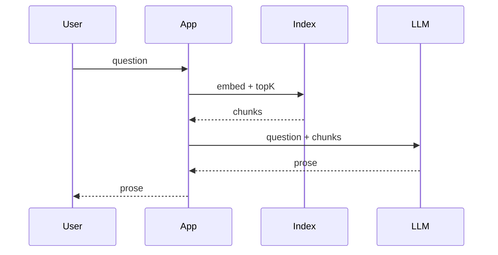

# Naive RAG (simple)

## How it works

This is the **toy**. It teaches the hop. It is not enterprise RAG.

## How it fails (must learn before agentic RAG)

| Failure | What happens |
|---|---|
| Bad chunking | Split in the middle of a policy; retrieve half a sentence |
| Wrong top-K | Miss the gold chunk; model confabulates (`SRC-NIST-AI-600-1`) |
| No ACL | Tenant B’s chunk in Tenant A’s prompt (`SRC-OWASP-LLM-TOP10-2026`) |
| No cite / refuse | Fluent fiction |
| Stale index | Correct retrieve of last quarter’s number |

## Evaluate

Gold questions with **gold chunk ids**. Score retrieve separately from generate.
