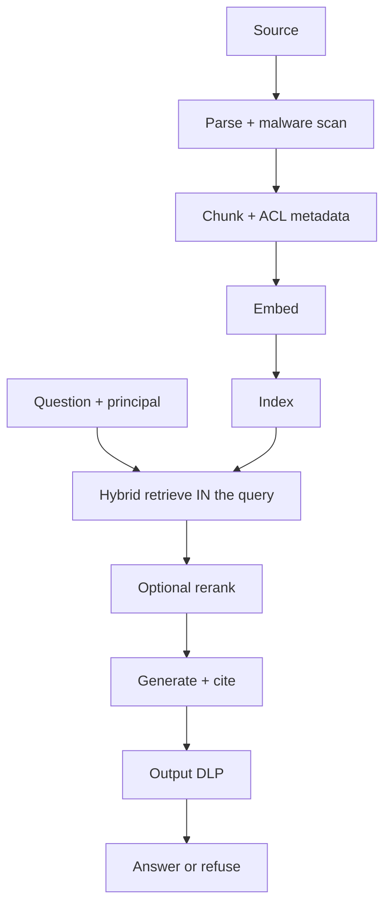

# RAG (Medium)

Same topic as [Naive RAG](02-simple.md). This page is **why retrieve is a system**, not a top-K demo.

## The pipeline, with failure points

| Stage | What goes wrong | Durable control |
|---|---|---|
| Chunk | Split a policy mid-sentence | Grain that matches questions |
| Embed | Stale vectors after an edit | Rebuild job + freshness SLO |
| Retrieve | Keyword miss or neighbor-that-sounds-right | Hybrid lexical + vector (`SRC-DATABRICKS-AI-SEARCH`) |
| ACL | Tenant B in Tenant A’s prompt | Filter **in** the similarity query (OWASP **LLM09**, `SRC-OWASP-LLM-TOP10-2026-GH`) |
| Generate | Empty retrieve → fluent fiction | Refuse; score retrieve **separately** from generate |
| Egress | Secret in the citation | Output DLP |

## Evaluate two systems

1. **Retrieve:** gold question → gold chunk ids (hit / miss / leak).
2. **Generate:** given the *right* chunks, is the answer faithful?

NIST AI 600-1 names confabulation as a generative risk (`SRC-NIST-AI-600-1`). A pretty answer with the wrong chunk is a retrieve bug.

## When this is still not an agent

If the next hop is always “search this corpus, then write,” that is **RAG**. A loop that *decides* whether to search, SQL, or refund is [agentic RAG](../09-AGENTIC-RAG/01-overview.md) — later, after this pipeline is honest.

## What should I remember?

Hybrid without ACL is still a leak. ACL without gold chunk ids is still unmeasured.

## What should I learn next?

[Complex — Azure / AWS / Google / Databricks products](15-real-world-example.md) · [Naive / hybrid / ACL](19-comparison.md)
