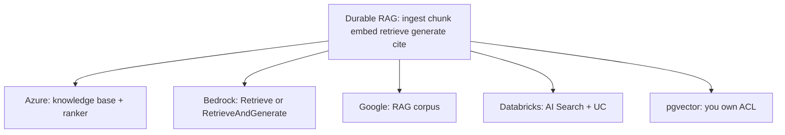

# RAG (Complex) — official products, same pipeline

Same topic as Simple / Medium. These are **documented cloud products**, not unofficial “how FAANG runs RAG internally” stories. No invented company case studies. Prices and SKU limits are **volatile** — not copied here.

## Vendor map (fetched 2026-09-07)

| Vendor | Official object | What the docs actually say | Source |
|---|---|---|---|
| **Microsoft** | Azure AI Search + Foundry IQ | Search underpins Foundry IQ: a managed, **permission-aware** knowledge layer. **Agentic retrieval** = multi-query plan → parallel keyword / vector / hybrid + semantic rerank → merged grounding. Some REST features GA (`2026-04-01`); portal and several capabilities remain **preview**. | `SRC-AZURE-AGENTIC-RETRIEVAL`, `SRC-AZURE-AI-SEARCH-SKU` |
| **Amazon** | Bedrock Knowledge Bases | `Retrieve` returns chunks. `RetrieveAndGenerate` = retrieve + `InvokeModel` + **citations**. `GenerateQuery` for structured stores. `AgenticRetrieveStream` decomposes and iterates. Page recommends a **Managed Knowledge Base**. | `SRC-AWS-BEDROCK-KB-RETRIEVE` |
| **Google** | Vertex / Gemini RAG Engine | Official process: ingest → chunk → embed → **corpus** (index) → retrieve → generate. Purpose: add **private** context so the model is less likely to hallucinate. | `SRC-GCP-RAG-ENGINE` |
| **Databricks** | AI Search (formerly Vector Search) MCP | Hybrid search as a managed retrieve surface; Unity Catalog / grants for lakehouse identity. Feature status is **Public Preview** on the MCP page we registered. | `SRC-DATABRICKS-AI-SEARCH`, `SRC-DATABRICKS-MCP` |
| **DIY** | pgvector on Postgres | Open-source vector similarity in Postgres. Operator/index names **UNVERIFIED** (README fetch timed out). | `SRC-PGVECTOR` |

## What maps to *this* lab’s flavors

| Lab flavor | Closest official knob (do not treat as 1:1) |
|---|---|
| Naive top-K | Any `Retrieve` / corpus query without hybrid or ACL |
| Hybrid | Azure keyword+vector+semantic rerank; Databricks hybrid; Bedrock retrieve + optional rerank model |
| Permission-aware | Foundry IQ / Azure docs: permission-aware knowledge; Databricks UC grants; you still must put the **principal in the query** (LLM09) |
| Agentic retrieve | Azure agentic retrieval; Bedrock `AgenticRetrieveStream` — only after naive retrieve is measured |

A managed SKU does **not** automatically implement LLM09. Shared index + polite filter-after-scan is still the failure mode (`SRC-OWASP-LLM-TOP10-2026-GH`).

## What we are not claiming

- Internal architecture of Bing, Google Search, or ChatGPT browsing.
- Latency percentiles, recall@k numbers, or dollar rates (Azure’s own page uses a **hypothetical** cost walkthrough — ignored here).
- That Agents Classic on Bedrock is the green-field default (`SRC-AWS-BEDROCK-AGENTS`: new customers directed to AgentCore).

## Architect challenge

Pick one vendor. Draw **toy** (PDF → embed → top-K) vs **their** object (knowledge base / corpus / AI Search). Mark where ACL is enforced. If you cannot point to a filter **in** retrieve, you do not have Architecture A ([enterprise RAG](../40-REFERENCE-ARCHITECTURES/A-enterprise-rag.md)).

## What should I learn next?

[Architecture A](../40-REFERENCE-ARCHITECTURES/A-enterprise-rag.md) · [When not / flavors](19-comparison.md) · [Sources catalog](../00-MASTER-MAP/sources-and-reading.md)
