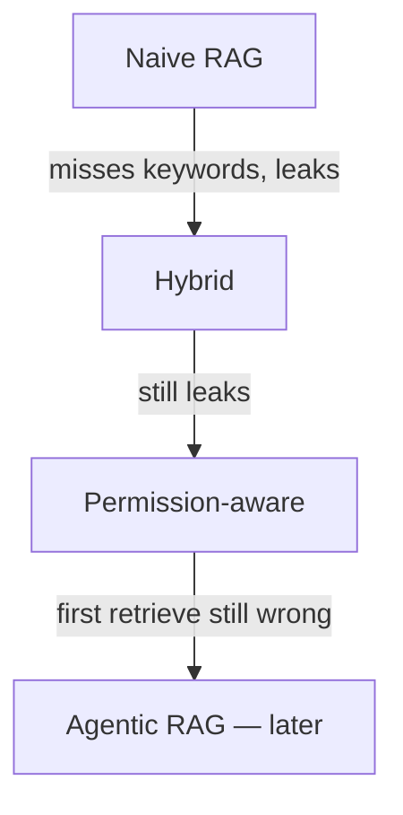

# Naive vs hybrid vs permission-aware

| | Naive | Hybrid | Permission-aware |
|---|---|---|---|
| Retrieve | Vector top-K | Lexical + vector | Same **plus** principal filter |
| IDs / codes | Weak | Stronger | Stronger |
| Multi-tenant | Unsafe | Still unsafe without ACL | Required |
| Lakehouse sketch | — | AI Search hybrid (`SRC-DATABRICKS-AI-SEARCH`) | UC / grants + filter |

## Toy vs production-oriented (from the canonical architecture)

**Toy:** PDF → chunks → embeddings → vector search → LLM.

**Production-oriented:** malware scan, parse, classify, **ACL on the chunk**, permission filter, citation, output DLP, audit, telemetry, evaluation ([reference-architecture.md](../00-MASTER-MAP/reference-architecture.md)).

## When not to use RAG

The answer is already in a SQL row the caller can query. Use the API. When not to use **agentic** RAG: [09 comparison](../09-AGENTIC-RAG/19-comparison.md).
