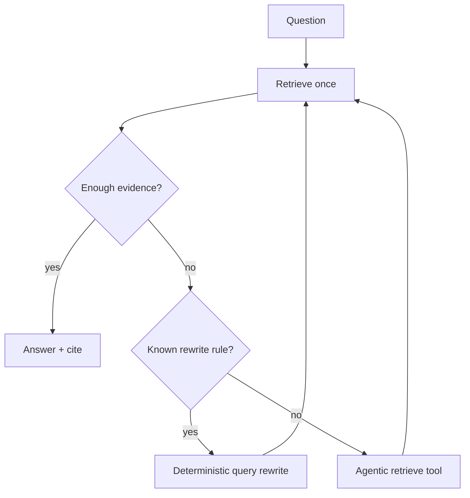

# Agentic RAG

Level 1. Retrieval becomes a **tool the model may call again** — rewrite query, search twice, follow a citation. This is **not** Gate 4 (no MCP catalog, no multi-agent).

## What is it?

A loop: generate a query → retrieve → observe → maybe retrieve again → answer. It exists because **one** retrieve often misses.

## Only after these failures are real

You already saw them in [08-RAG/02-simple.md](../08-RAG/02-simple.md): bad chunk, wrong top-K, no ACL, no refuse, stale index. If you have not measured those, an agentic loop **amplifies** them (more calls, more leak surface). OWASP **excessive agency** (`SRC-OWASP-LLM-TOP10-2026`). Prefer a function when a function is enough (`SRC-MS-AGENT-FRAMEWORK`).

## Data / cloud analogy

A human analyst who runs a second SQL after the first result is empty — useful. A human who gets `UPDATE` on prod because the first SELECT was empty — not useful.

## What should I remember?

Agentic RAG is a **retry policy with a brain**. Brains need budgets and authz.

## What should I learn next?

[19-comparison.md](19-comparison.md), then stop until Gate 4.
