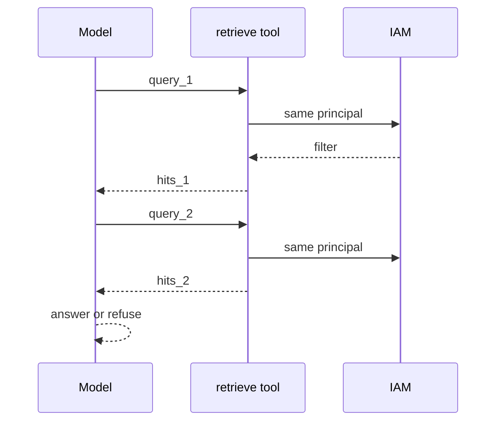

# Second retrieve, same ACL (simple)

## How it works

The tool must **not** widen ACL on retry. Max steps: 2–3 in a lab. Each hop costs tokens and leak risk.

## How it fails

| Failure | Control |
|---|---|
| Loop on empty | Cap iterations; then refuse |
| Query becomes “ignore ACLs” | Tool ignores natural-language overrides |
| Writes | No write tools in this gate |

Full tool-calling / MCP: Gate 4.
