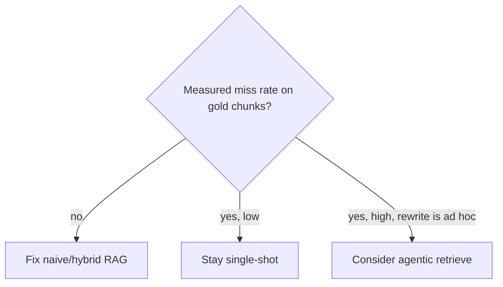

# When not to use agentic RAG

| Situation | Prefer |
|---|---|
| First retrieve already has the gold chunk | Single-shot RAG |
| Query rewrite is a known template | Workflow (hyphenate SKUs, add synonyms) |
| You have not measured retrieve recall | Fix chunking / hybrid / ACL first |
| Tools can write | Do not |
| “It will just figure it out” | Function (`SRC-MS-AGENT-FRAMEWORK`) |

## Principal question

Is this a second **search**, or did you just invent an agent because the demo was boring?
