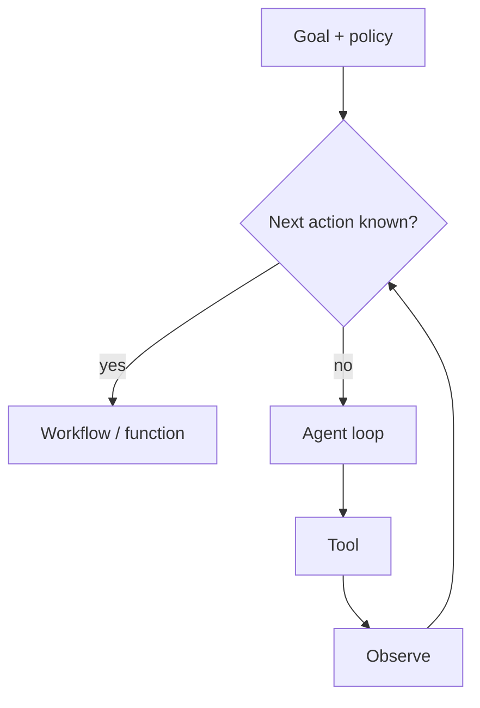

# Agents

Level 1. An **agent** is a runtime that may **choose the next action** (usually a tool) under uncertainty. A single structured LLM call is an [application](../05-LLM-APPLICATION-ENGINEERING/01-overview.md), not an agent. Retrieval-as-a-second-search is [agentic RAG](../09-AGENTIC-RAG/01-overview.md) — link, do not duplicate.

## What is it?

Microsoft Learn’s Agent Framework overview: use an agent when the task is open-ended or needs autonomous tool use; use a **workflow** when steps are well-defined; **if you can write a function, do that instead** (`SRC-MS-AGENT-FRAMEWORK`, re-fetched 2026-09-07).

OpenAI Agents SDK (official, re-fetched 2026-09-07): an agent is an LLM with instructions and tools, plus a loop until the task completes (`SRC-OPENAI-AGENTS-SDK`). That is a vendor primitive set, not a requirement to use that SDK.

## Data / cloud analogy

A Kubernetes controller reconciles toward a desired state. An agent reconciles toward a *goal* by calling APIs. A CronJob that always calls the same three endpoints is a **workflow**.

## Why it exists

Unknown next hop. Not because “AI” looks better on a slide.

## Mandatory next page

[When not to use an agent](19-comparison.md). Then [flavors map](03-logical.md).

## What should I remember?

Agency is a control-plane decision. OWASP **excessive agency** (`SRC-OWASP-LLM-TOP10-2026`).

## What should I learn next?

[When not to use an agent](19-comparison.md) · [Flavors](03-logical.md) · [RAG vs agent sheet](../50-CHEAT-SHEETS/rag-vs-agent.md)
