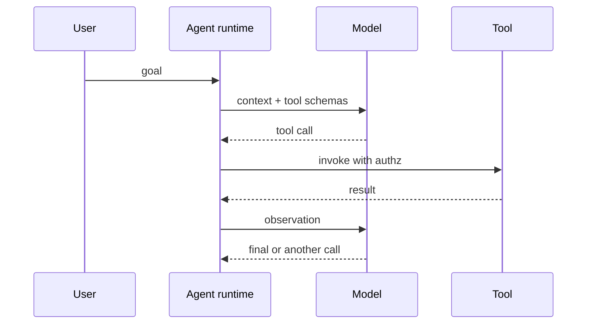

# One tool loop (simple)

## How it works

1. Bound the tool list (allow-list).
2. Cap turns (budget).
3. Run the model → maybe invoke a tool → observe.
4. Stop on final, refuse, or cap.

OpenAI’s SDK documents a built-in loop, handoffs, and guardrails (`SRC-OPENAI-AGENTS-SDK`). Exact class names beyond what that page states are not required here.

## How it fails

| Failure | Control |
|---|---|
| Wrong tool | Smaller catalog; unit-test tool choice |
| Infinite loop | Max turns |
| Tool writes prod | HITL / no write tools |
| Prompt injection via tool output | Treat tool output as untrusted (`SRC-OWASP-LLM-TOP10-2026`) |

## When this is still too much

If the sequence is always `get_order` then `format_reply`, delete the loop (`SRC-MS-AGENT-FRAMEWORK`).
