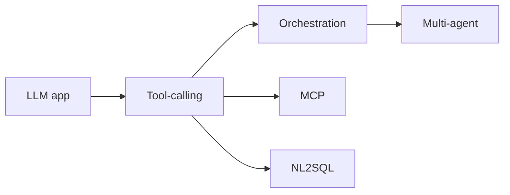

# Agent flavors map (Medium)

Same topic as the [overview](01-overview.md). Taxonomy list from [master-taxonomy.md](../00-MASTER-MAP/master-taxonomy.md). This is a **map**, not 21 files per flavor. Next depth: [Complex — vendor runtimes](15-real-world-example.md).

| Flavor | Kind | This lab |
|---|---|---|
| Simple LLM app / prompt-driven / structured-output | **Not an agent** | [05](../05-LLM-APPLICATION-ENGINEERING/01-overview.md) |
| Deterministic workflow / API / SQL / pipeline | **Negative space** | This page + [11](../11-AGENT-ORCHESTRATION/01-overview.md) |
| Tool / function-calling | Agent primitive | [12](../12-TOOLS-FUNCTION-CALLING/01-overview.md) |
| ReAct | Thought → act → observe | [02-simple.md](02-simple.md) |
| Workflow-based | Graph with optional LLM nodes | [11](../11-AGENT-ORCHESTRATION/01-overview.md) |
| Router | Dispatch to a specialist | [14](../14-MULTI-AGENT-SYSTEMS/01-overview.md) |
| Planner / executor | Plan then run | [11](../11-AGENT-ORCHESTRATION/01-overview.md) |
| Stateful / memory-enabled | Session / store | LangGraph persistence docs (`SRC-LANGGRAPH-PERSISTENCE`) |
| HITL / approval-based | Human gates a tool | [11](../11-AGENT-ORCHESTRATION/01-overview.md) |
| Long-running / durable / background | Resume after crash | LangGraph: durable execution (`SRC-LANGGRAPH-OVERVIEW`) |
| Event-driven | Triggered by a message | Same as any consumer + policy |
| Autonomous / semi-autonomous | How much may proceed without a human | Policy, not a product |
| Agentic RAG | Retrieve as a tool | [09](../09-AGENTIC-RAG/01-overview.md) |
| Multi-agent / supervisor / handoff / parallel / hierarchical | After single-agent failures | [14](../14-MULTI-AGENT-SYSTEMS/01-overview.md) |
| MCP-based | Tools via protocol | [13](../13-MCP/01-overview.md) |
| NL-to-SQL | Generate SQL | [15](../15-NL2SQL/01-overview.md) — security first |
| Data-engineering / data-quality / cloud-ops / security / coding / research / enterprise knowledge / CS / decision-support | **Use-case labels** | Same primitives + domain tools; not extra runtimes |

OpenAI SDK adds documented **handoffs**, **guardrails**, **sandbox agents**, **sessions**, **HITL** (`SRC-OPENAI-AGENTS-SDK`). Microsoft documents **Harness Agent** (opinionated long-task agent) and **workflows** separately from single agents (`SRC-MS-AGENT-FRAMEWORK`). Those names are vendor; the flavors above stay durable.

