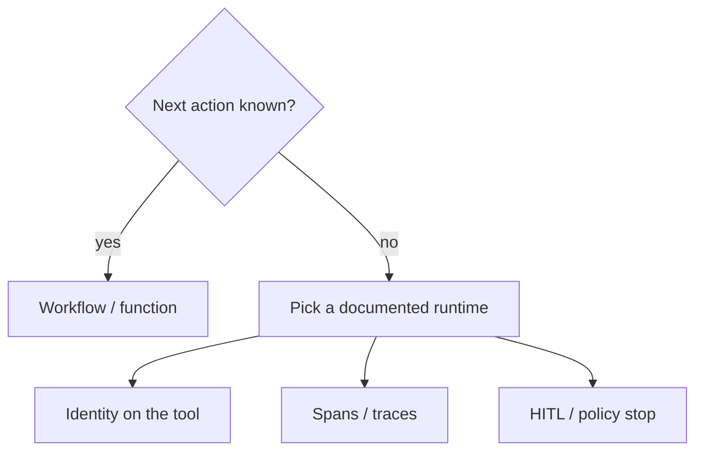

# Agents (Complex) — official runtimes, same decision

Same topic as [Overview](01-overview.md) and [Medium flavors](03-logical.md). This page compares **what vendors document**, not unofficial “how Amazon runs Alexa internally” stories.

Microsoft’s own overview still wins the first question: **if you can write a function, do that** (`SRC-MS-AGENT-FRAMEWORK`).

## Official primitives (fetched / registered 2026-09-07)

| Publisher | Product (docs) | What they name | Lab flavor | Source |
|---|---|---|---|---|
| Microsoft | Agent Framework | Agent vs **workflow**; function-first | When-not + workflow | `SRC-MS-AGENT-FRAMEWORK` |
| Microsoft | Foundry Agent Service / hosted agents | Hosted container agents; A2A **preview** | Long-running / hosted | `SRC-MS-FOUNDRY-AGENTS`, `SRC-MS-HOSTED-AGENTS` |
| OpenAI | Agents SDK | Agent + tools + loop; handoffs, guardrails, sessions, HITL, MCP | ReAct / HITL / handoff | `SRC-OPENAI-AGENTS-SDK` |
| Google | Agent Development Kit (ADK) | Agents, workflows, evaluation, deployment | Toolkit | `SRC-GOOGLE-ADK` |
| Amazon | Bedrock AgentCore | Modular runtime, gateway, identity, policy, memory, observability | Hosted control plane | `SRC-AWS-BEDROCK-AGENTCORE` |
| Amazon | Bedrock Agents *Classic* | Action groups + knowledge bases — **not** green-field for new customers | Legacy | `SRC-AWS-BEDROCK-AGENTS` |
| LangChain | LangGraph | Durable execution, HITL, persistence / checkpointers | Stateful / durable | `SRC-LANGGRAPH-OVERVIEW`, `SRC-LANGGRAPH-PERSISTENCE` |
| CrewAI | Crews / flows | Multi-agent crews vs explicit flows | Multi-agent vs workflow | `SRC-CREWAI-INTRO` |
| LlamaIndex | Agents + workflows | Agents that can use retrieve as a tool | Agentic RAG | `SRC-LLAMAINDEX-AGENTS` |

## What every vendor still leaves to you

| Control | Why a SKU does not finish it |
|---|---|
| Tool identity | Hidden system-prompt “you may not refund” is LLM08-shaped (`SRC-OWASP-LLM-TOP10-2026-GH`) |
| Excessive agency | OWASP LLM03 — cap tools, not adjectives |
| Observability | OpenTelemetry GenAI conventions are **development** status (`SRC-OTEL-GENAI-SEMCONV`, `SRC-OTEL-DOCUMENT-STATUS`) |
| Price | AgentCore and Azure pages point at consumption / pricing sites — dollar rates **UNVERIFIED** |

## Architect challenge

Take a refund that is already a state machine. Implement it as a workflow. Then list the **one** uncertainty that would justify an agent. If you cannot name it, do not pick a vendor agent SKU.

Recent shipped assignments (Duolingo, Mobileye, KTern SAP, Microsoft claw): [41 — recent agentic assignments](../41-REAL-WORLD-USE-CASES/recent-agentic-assignments.md).

## What should I learn next?

[When not](19-comparison.md) · [Recent assignments](../41-REAL-WORLD-USE-CASES/recent-agentic-assignments.md) · [Sources catalog](../00-MASTER-MAP/sources-and-reading.md)
