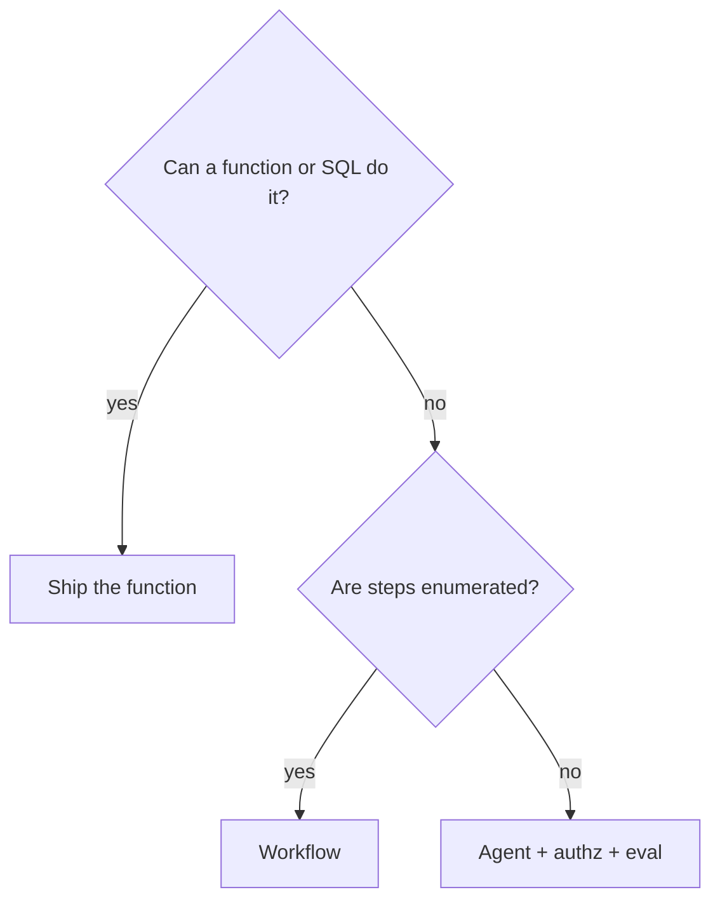

# When not to use an agent

First-class page. Also: [foundations when-not](../01-FOUNDATIONS/19-comparison.md).

Microsoft Learn table (re-fetched 2026-09-07, `SRC-MS-AGENT-FRAMEWORK`):

| Use an agent when… | Use a workflow when… |
|---|---|
| Task is open-ended or conversational | Process has well-defined steps |
| Autonomous tool use and planning | Explicit control over execution order |
| A single LLM call (possibly with tools) suffices | Multiple agents or functions must coordinate |

And: **if you can write a function to handle the task, do that instead of using an AI agent.**

| Prefer | Instead of an agent |
|---|---|
| Workflow / DAG / state machine | Known steps |
| REST / SQL / semantic layer | Known lookup |
| Structured LLM app | One extraction / classify |
| Pipeline (Spark / dbt) | Deterministic transform |
| Human form + API | No decision under uncertainty |

## What a principal would challenge

A `tools=` list of length 1 that is always called.
