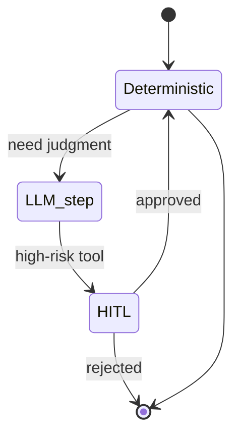

# Orchestration

Level 1. Orchestration is **who runs which step, in what order, with what state** — including humans and crashes.

## What is it?

LangGraph’s official overview (re-fetched 2026-09-07, `SRC-LANGGRAPH-OVERVIEW`): a low-level runtime to **mix deterministic, hand-coded steps with LLM-driven steps** in one graph; central benefits include **durable execution**, **streaming**, **human-in-the-loop**, and **persistence**. You do not need LangChain to use LangGraph (same page).

Microsoft Agent Framework documents **workflows** as explicit execution paths that connect agents and functions (`SRC-MS-AGENT-FRAMEWORK`).

Vendor marketing (“trusted by …”) on the LangGraph page is **not** used as architecture proof.

## Data / cloud analogy

Airflow / Step Functions / Temporal: known graph, retries, human approval nodes. An “agent graph” that is 100% LLM-chosen edges is just an unbounded loop.

## Durability

If the process can outlive a pod restart, you need a checkpointer / session store. LangGraph persistence docs: checkpointers vs stores (`SRC-LANGGRAPH-PERSISTENCE`). Exact API names: re-read those docs at implement time.

## When not to use an agent graph

The graph never branches on a model decision — use the workflow engine you already have.

## What should I learn next?

[02-simple.md](02-simple.md)
