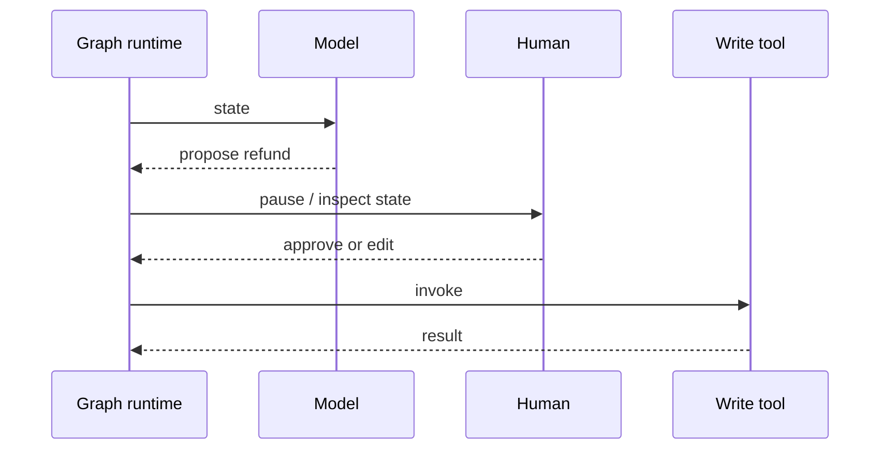

# HITL on a write (simple)

LangGraph lists HITL as inspecting and modifying agent state (`SRC-LANGGRAPH-OVERVIEW`). OpenAI Agents SDK also documents built-in human-in-the-loop (`SRC-OPENAI-AGENTS-SDK`). Neither page is a license to skip authz.

## How it fails

| Failure | Control |
|---|---|
| HITL on every read | Fatigue; only gate **mutating** or high-blast tools |
| Resume without identity | Confused deputy |
| No timeout on pause | Stuck work items |
