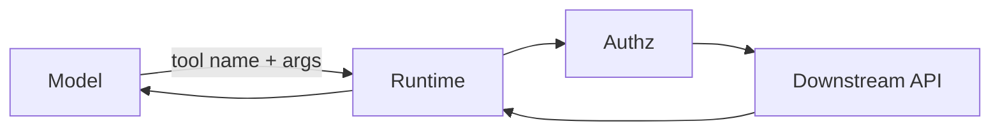

# Tools / function calling

A **tool** is an API the model is allowed to request. It is not “the model running Python.” You bind a **schema**, **identity**, and **blast radius**.

## What is it?

Same as exposing a method on a service: name, parameters, authz, timeout, idempotency. The model proposes arguments; **your runtime** invokes.

OpenAI Agents SDK: function tools from Python functions with schema generation (`SRC-OPENAI-AGENTS-SDK`). MCP can expose the same idea over a protocol ([13](../13-MCP/01-overview.md)).

## Data / cloud analogy

An API gateway + IAM. You would not give a batch job `*:*` on prod because a notebook asked nicely.

## Blast radius

Read vs write, one tenant vs all, delete vs list. OWASP **excessive agency** (`SRC-OWASP-LLM-TOP10-2026`).

## When not to add a tool

You always call it — then it is just code (`SRC-MS-AGENT-FRAMEWORK`).

## What should I learn next?

[MCP vs tools](../13-MCP/19-comparison.md) · [MCP vs tools sheet](../50-CHEAT-SHEETS/mcp-vs-tools.md)
