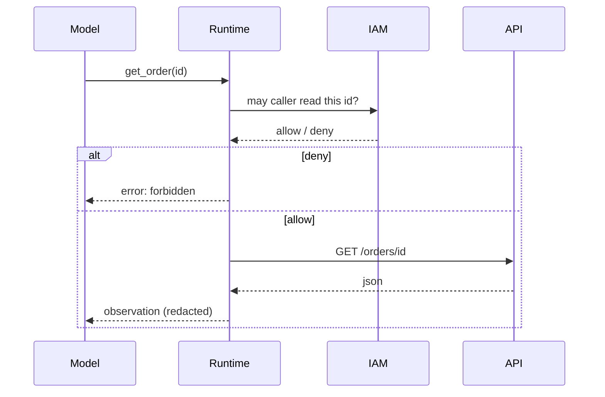

# One tool call (sequence)

## How it fails

| Failure | Control |
|---|---|
| Model invents `id` of another tenant | Authz uses **caller**, not model text |
| Timeout | Deadline; circuit breaker |
| Tool returns PII | Redact before re-prompt (`SRC-NIST-AI-600-1`) |
| Injection in observation | Untrusted content (`SRC-OWASP-LLM-TOP10-2026`) |

SDK method names are volatile — do not copy a remembered client call as pinned truth.
