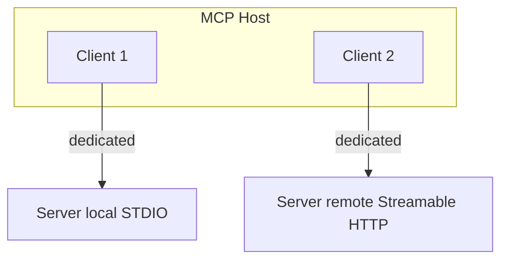

# Model Context Protocol

Official architecture (re-fetched 2026-09-07, `SRC-MCP-ARCHITECTURE`): MCP is a **context-exchange protocol**. It does **not** dictate how the host uses an LLM.

## Participants

The **MCP host** (an AI application) creates **one MCP client per MCP server**. Each client keeps a dedicated connection to that server.

- **Host** — coordinates clients (docs example: an IDE acting as host).
- **Client** — connection + context for the host.
- **Server** — program that provides context (local or remote).

Local servers typically use **STDIO** (often one client). Remote servers typically use **Streamable HTTP** (many clients).

## Layers (official)

**Data layer:** JSON-RPC — capability/version discovery; primitives **tools, resources, prompts**, notifications.  
**Transport layer:** connection, framing, authorization.

## Intro

`SRC-MCP-INTRO` — what MCP is. Use both IDs when teaching.

## When not to use MCP

One app, three in-process functions — plain function calling ([12](../12-TOOLS-FUNCTION-CALLING/01-overview.md)).

## What should I learn next?

[MCP vs function calling](19-comparison.md) · [Cheat-sheet](../50-CHEAT-SHEETS/mcp-vs-tools.md)
