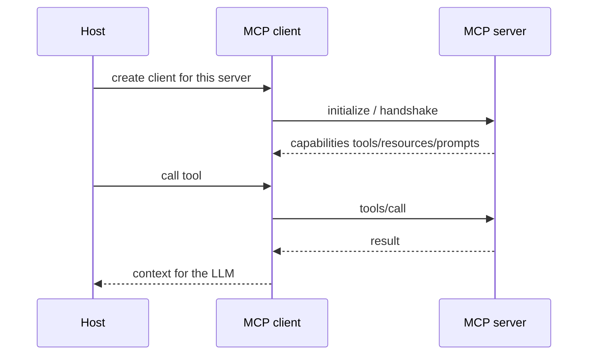

# Two servers, two clients (simple)

Official example pattern: a host connecting to a filesystem-style local server and a remote server creates **two client objects** (`SRC-MCP-ARCHITECTURE`).

Wire method names (`tools/call`, etc.) follow the spec — confirm the current spec version before teaching a wire course. This lab does not pin a spec date beyond “docs as of 2026-09-07.”

## How it fails

| Failure | Note |
|---|---|
| Host == server confusion | Server provides context; host is the app |
| MCP as authz | Transport may have auth; **data plane grants** are still yours |
| Sampling / extra features | Re-read current spec; do not teach deprecated primitives from memory |
