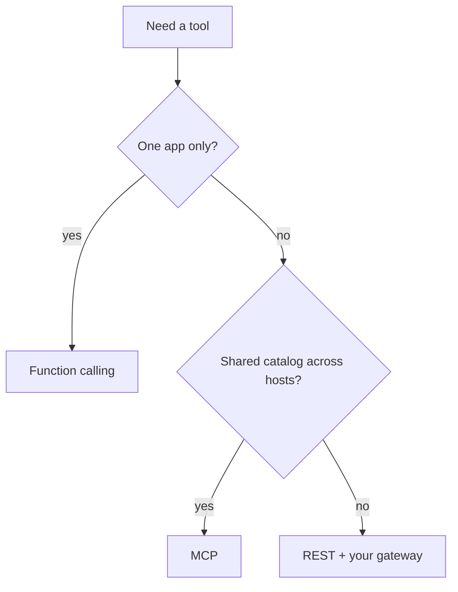

# MCP vs function calling vs REST

| | Function calling | REST | MCP |
|---|---|---|---|
| What it standardizes | One runtime’s tool schema | HTTP resource | How **hosts** get tools/resources/prompts from **servers** |
| Multi-host reuse | Poor | Via your gateway | Designed for many hosts (`SRC-MCP-ARCHITECTURE`) |
| LLM usage | N/A | N/A | Explicitly **out of scope** for the protocol |
| Identity | Your code | OAuth/IAM | Still your policy |

OpenAI Agents SDK documents MCP **server tool calling** alongside function tools (`SRC-OPENAI-AGENTS-SDK`). That is an integration, not a replacement for IAM.

