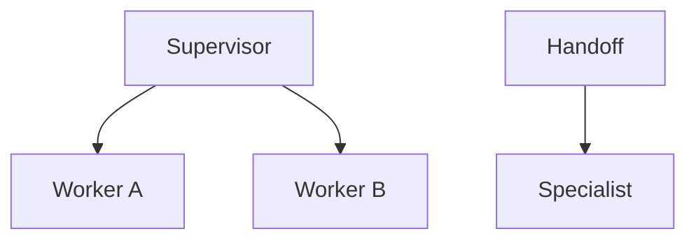

# Multi-agent systems

Level 1. Add more agents only after a **single** agent’s failure modes are real: wrong tool, loops, confused identity, unreadable traces.

## What is it?

Several specialized loops plus a **coordination rule**: supervisor, handoff, parallel, or hierarchy.

OpenAI Agents SDK (re-fetched 2026-09-07): **handoffs** / agents-as-tools for delegation; their orchestration page distinguishes handoffs vs manager-style (`SRC-OPENAI-AGENTS-SDK`). Microsoft workflows connect multiple agents on **explicit** paths (`SRC-MS-AGENT-FRAMEWORK`).

## Data / cloud analogy

Microservices. Two services need a contract and tracing. Ten services without a supervisor is a distributed ball of yarn.

## When not

One specialist with three tools is enough. Agentic RAG is **one** agent with a retrieve tool — [09](../09-AGENTIC-RAG/01-overview.md), not this folder.

## What should I remember?

Every extra agent is an extra confused-deputy and eval surface.

## What should I learn next?

[Comparison](19-comparison.md) · [Arch E](../40-REFERENCE-ARCHITECTURES/E-multi-agent.md) · [Interview Q6](../44-ARCHITECTURE-INTERVIEWS/01-overview.md)
