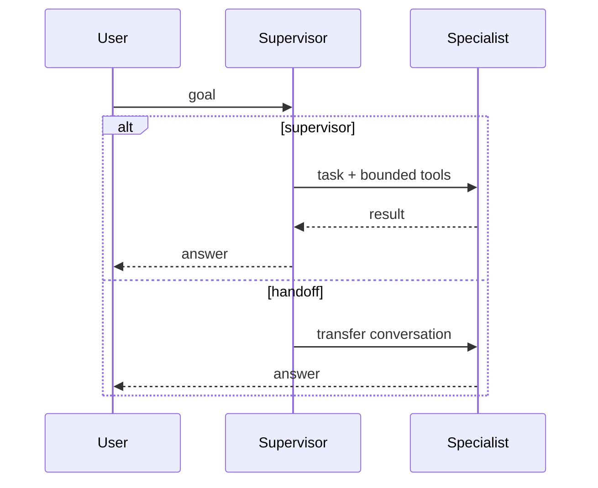

# Supervisor vs handoff (simple)

| | Supervisor / worker | Handoff |
|---|---|---|
| Who answers the user | Supervisor | Specialist after transfer |
| Tool sets | Isolated per worker | Specialist’s set |
| Failure | Supervisor can retry another worker | User is now in another policy domain |

OpenAI documents both styles (`SRC-OPENAI-AGENTS-SDK`). Do not mix them accidentally.
